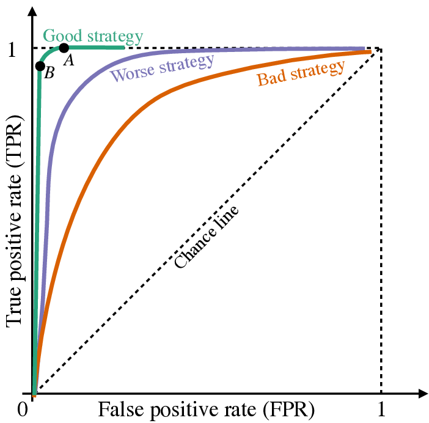

# Classification

*In the third week of class, we will look at classification...*

So far, we have looked at making predictions in which the outcome is a continous value. Today, we will look at **classification**, in which our outcome is a categorical value. We first start with binary classification, in which there is only two possible outcomes, usually defined by `True` or `False` values. However, for many classification models, they predict the *probability* of whether an event happens or not, on a continuous scale from 0 to 1. Then, given the predicted probability, we draw a boundary to classify the outcome as `True` or `False` values.

Using the same data as before, we define someone is at risk for $Hypertension$ if their diastolic pressure is greater than 80 or their systolic pressure is greater than 130. Our goal is to classify whether someone is at high risk for $Hypertension$.

Let's look at the distribution of Hypertension vs. No Hypertension:

```{python}
import pandas as pd
import seaborn as sns
import numpy as np
from sklearn.model_selection import train_test_split
import matplotlib.pyplot as plt
from formulaic import model_matrix
from sklearn import linear_model
from sklearn.linear_model import LogisticRegression, LinearRegression
from sklearn.metrics import mean_squared_error, log_loss, accuracy_score, confusion_matrix, ConfusionMatrixDisplay

nhanes = pd.read_csv("classroom_data/NHANES.csv")
nhanes.drop_duplicates(inplace=True)
nhanes['Hypertension'] = (nhanes['BPDiaAve'] > 80) | (nhanes['BPSysAve'] > 130)

nhanes['Hypertension2'] = nhanes['Hypertension'].replace({True: "Hypertension", False: "No Hypertension"})

plt.clf()
ax = sns.histplot(x = "Hypertension2", data = nhanes)
plt.show()

```

We see that there is a lot more data for the No Hypertension group (88%) compared Hypertension group (22%), so this could be a potential **class imbalance** in our modeling. We will revisit the consequence of class imbalance later today.

We then split our data in training and testing, as usual:

```{python}
nhanes_train, nhanes_test = train_test_split(nhanes, test_size=0.2, random_state=42)
```

Then, we start looking at possible predictors that may be associated with our binary response. Let's consider $BMI$ as a candidate predictor:

```{python}
plt.clf()
ax = sns.boxplot(y="Hypertension2", x="BMI", data=nhanes_train)
ax.set_ylabel('')
plt.show()
```

Great, there seems to be an association. However, recall that our classification model is going to be *making predictions of probabilit*y *on a continuous scale of 0 to 1* before we classify it into two categories. Therefore, it makes sense to examine the relationship between BMI and empirical Hypertension probability in our data exploration. To do so, we will need to *bin* our data by small chunks of BMI values and calculate the empirical Hypertension probability for that bin. We plot the midpoint binned BMI value vs. empirical Hypertension probability for 20 bins:

```{python}
nhanes_train['bins'] = pd.cut(nhanes_train['BMI'], bins=20) 


nhanes_train_binned = nhanes_train.groupby('bins')['Hypertension'].agg(['sum', 'count']).reset_index()
nhanes_train_binned['p'] = nhanes_train_binned['sum'] / nhanes_train_binned['count']
 
nhanes_train_binned['log_odds'] = np.log(nhanes_train_binned['p'] / (1 - nhanes_train_binned['p']))
nhanes_train_binned['bin_midpoint'] = nhanes_train_binned['bins'].apply(lambda x: x.mid)

nhanes_train_binned = nhanes_train_binned.replace([np.inf, -np.inf], np.nan)
nhanes_train_binned = nhanes_train_binned.dropna()

#predictor vs probability
plt.clf()
plt.scatter(nhanes_train_binned['bin_midpoint'], nhanes_train_binned['p'], color='blue')
plt.xlabel('BMI - Binned Midpoint')
plt.ylabel('Proportion of people with Hypertension')
plt.ylim(0, 1)
plt.grid(True)
plt.show()

```

Great, looks like we have a relationship, but it doesn't encompass the full spectrum of probabilities.

## Logistic Regression

Now, let's build the model $P(Hypertension) = f(BMI)$ to make a prediction of $Hyptertension$ given $BMI$. Notice that the left hand side of the equation is the *probability* of having $Hypertension$, indicated by the $P()$ function.

### Logistic Transformation

Our usual Linear Regression model

$$P(Hypertension)=\beta_0+\beta_1 \cdot BMI$$

*does not* give us outputs between 0 and 1. To deal with this, we perform the **Logistic Transformation:**

$$P(Hypertension) = \frac{1}{1+e^{-(\beta_0 + \beta_1 \cdot BMI)}}$$

This forces the right hand side of the equation to be between 0 and 1, which is at the scale of probability. The relationship between the X and Y axis is not going to be a straight line, but rather a non-linear, "S-shaped" one. Let's fit this model and look at the model visually to understand.

```{python}
y_train, X_train = model_matrix("Hypertension ~ BMI", nhanes_train)
y_test, X_test = model_matrix("Hypertension ~ BMI", nhanes_test)

logit_model = LogisticRegression().fit(X_train, y_train)

plt.clf()
plt.scatter(X_train.BMI, logit_model.predict_proba(X_train)[:, 1], color="red", label="Fitted Line")
plt.scatter(nhanes_train_binned['bin_midpoint'], nhanes_train_binned['p'], color='blue')
plt.xlabel('BMI')
plt.ylabel('Proportion of people with Hypertension')
plt.ylim(0, 1)
plt.legend()
plt.show()
```

This shows that the logistic model was able to model some of the relationship between $BMI$ and $P(Hypertension)$, but the model predicts much higher $P(Hypertension)$ at high values of $BMI$.

Showing goodness of fit via this plot is rather difficult, because it is hard to figure out visually when the data can fall on a logistic S-curve - one can imagine a red line stretched out more, etc. If we move the equation around so that the right hand side is linear:

$$log(\frac{P(Hyptertension)}{1 - P(Hyptertension)}) = \beta_0 + \beta_1 \cdot BMI$$

The left hand side of the equation is called the **Log-Odds**. A Log-Odds of 0 indicate a 50:50 probability, positive values indicate a higher than 50% probability, and negative values indicate a lower than 50% probability.

```{python}
plt.clf()
p = logit_model.predict_proba(X_train)[:, 1]
log_odds = np.log(p / (1 - p))
plt.scatter(X_train.BMI, log_odds, color="red", label="Fitted Line")
plt.scatter(nhanes_train_binned['bin_midpoint'], nhanes_train_binned['log_odds'], color='blue')
plt.xlabel('BMI')
plt.ylabel('Log Odds of Hypertension')
plt.legend()
plt.show()
```

Now we see why exactly our logistic regression model was limited to fit the relationship between predictor and response, as we have reformulated the problem closer to a linear regression problem. We could improve the model by using polynomial terms.

When working with multiple predictors, these plots can be a starting point to select for predictors, but in the multi-dimensional setting these visualizations are not sufficient to determine the model fit. We will need to look at residual plots in the diagnosis, which we will revisit later.

### Model Evaluation

Remember that we still need to get from probability to classification. We will set a reasonable, interpretable cutoff of 50%: if the probability of having Hypertension is \>=50%, then classify that person having Hypertension. Otherwise, they do not have Hypertension. This cutoff called the **Decision Boundary**.

As an aside, we can also evaluate the model based just on the probability it predicted, and it actually contains more information than if we had set our decision boundary and classified our response as a True/False dichotomy. However, metrics of evaluation on probabilities, namely [**Cross Entropy** and **Brier Scores**](https://aml4td.org/chapters/cls-metrics.html#sec-cls-metrics-soft), are harder to interpret, and are less commonly reported in biomedical research. We still stick with evaluation metrics for classification for this course.

Given this decision boundary, let's examine evaluate the model on the test set, and look at its accuracy rate:

```{python}
print('Accuracy = ', accuracy_score(y_test, logit_model.predict(X_test))) 
```

Okay, that's a starting point!

However, we need to be mindful of the class imbalance we saw in the dataset at the beginning of the lesson. Recall we roughly have 88% of our data as No Hypertension. If we have a classifier that *always* predicted No Hypertension, then we achieve a 88% accuracy rate, but this model is not particularly novel and it raises questions of whether our model of 76% accuracy is novel.

Well, break down the accuracy by the Hypertension events and No Hypertension events:

Our **Sensitivity** (accuracy of Hypertension events) is defined as: $\frac{TruePositives}{TruePostives+FalseNegatives}$, which is 15/(15+325) = 4%

Our **Specificity** (accuracy of No Hypertension events) is defined as: $\frac{TrueNegatives}{TrueNegatives+FalsePositives}$, which is 1128/(1128+24) = 98%.

Therefore, we do a pretty terrible job of predicting the Hypertension cases!

We can describe the detailed numbers via a table called the **Confusion Matrix**:

```{python}
cm = confusion_matrix(y_test, logit_model.predict(X_test))
disp = ConfusionMatrixDisplay(confusion_matrix=cm, display_labels=["No Hypertension", "Hyptertension"])
disp.plot()
plt.show()
```

The top left hand corner is the number of True Negatives (1128), the top right hand corner is the number of False Positives (24), the bottom left corner is the number of False Negatives (325), and the bottom right corner is the number of True Positives (15).

What happened exactly? Let's look back at the Training Data: it seems that from the plots that we are making predictions of Hypertension for BMI of 50 or more. However, there are so few people with such a high BMI that even if most of those folks have Hypertension, the model missed most of the folks with Hypertension in the 20-40 BMI range. This range wasn't high enough for our decision boundary of 50% probability, so we missed out most of our Hypertension people.

What can we do? There are lot's of things we can change about the model, but let's tinker around with the decision boundary for a moment. We can change the decision boundary to be lower, which will improve our sensitivity at the expense of our specificity, and vice versa if we change the decision boundary to be higher. What if we set the new decision boundary to be .2?

```{python}
new_pred = [1 if x >= .2 else 0 for x in logit_model.predict_proba(X_test)[:, 1]]

cm = confusion_matrix(y_test, new_pred)
disp = ConfusionMatrixDisplay(confusion_matrix=cm, display_labels=["No Hypertension", "Hyptertension"])
disp.plot()
plt.show()
```

Our **Sensitivity** (accuracy of Hypertension events) is defined as: $\frac{TP}{TP+FN}$, which is 254/(254+86) = 74%

Our **Specificity** (accuracy of No Hypertension events) is defined as: $\frac{TN}{TN+FP}$, which is 582/(582+570) = 51%.

We have improved our sensitivity at the cost of our specificity! You can explore the range of tradeoffs from the decision boundary cutoff using the Receiver Operating Characteristic (ROC) curve in the Appendix.

Let's pause here for model evaluation for now, and look back at the assumptions of logistic regression, as we did for linear regression.

### Another model

What happens if we refit the model with a 3rd degree polynomial? Let's see what it looks like at the Log-Odds scale. Is it better than the linear form?

```{python}
y_train2, X_train2 = model_matrix("Hypertension ~ poly(BMI, degree=3, raw=True)", nhanes_train)
y_test2, X_test2 = model_matrix("Hypertension ~ poly(BMI, degree=3, raw=True)", nhanes_test)
logit_model2 = LogisticRegression().fit(X_train2, np.ravel(y_train2))

plt.clf()
plt.scatter(nhanes_train_binned['bin_midpoint'], nhanes_train_binned['log_odds'], color='blue')

p = logit_model2.predict_proba(X_train2)[:, 1]
log_odds = np.log(p / (1 - p))
plt.scatter(X_train2[X_train2.columns[1]], log_odds, color="red", label="Fitted Line")

plt.xlabel('BMI')
plt.ylabel('Log Odds of Hypertension')
plt.legend()
plt.show()

```

Is it any better? Let's see its performance on the test set:

```{python}
print('Accuracy = ', accuracy_score(y_test2, logit_model2.predict(X_test2))) 
```

```{python}
cm = confusion_matrix(y_test2, logit_model2.predict(X_test2))
disp = ConfusionMatrixDisplay(confusion_matrix=cm, display_labels=["No Hypertension", "Hyptertension"])
disp.plot()
plt.show()
```

Oops! Even worse!

## Assumptions of logistic regression

Similar to how we explored linear regression, let's examine the assumptions needed for logistic regression for good predictions.

### Linearity of log odds of response - predictor relationship

Recall that our logistic regression model

$$P(Hyptertension) = \frac{1}{1+e^{-(\beta_0 + \beta_1 \cdot BMI)}}$$

can be rewritten as:

$$log(\frac{P(Hyptertension)}{1 - P(Hyptertension)}) = \beta_0 + \beta_1 \cdot BMI$$

where the left hand side is called the **log odds** or the **logit**. From exploratory data analysis, we need the log odds of the response to be in linear relationship with each predictor in logistic regression. We examined that in our example today. When we have many predictors, this visualization is going to not work.

Recall back in linear regression, we can check the linearity between response and multiple predictors by calculating the **residual** and compare it to the predicted response. There is a similar analysis in logistic regression: **residual** **deviance.** We plot the residual deviance against the predicted probability. Note that we have to use the `statsmodels` package here, as its model calculates residual deviance for us, whereas `sklearn` does not.

```{python}
import statsmodels.api as sm

model = sm.Logit(y_train, X_train)
results = model.fit()

plot_df = pd.DataFrame({'Predicted_Probability': results.predict(X_train), 'Residual_Deviance': results.resid_dev})
plt.clf()
ax = sns.regplot(x="Predicted_Probability", y="Residual_Deviance", data=plot_df, lowess=True, scatter_kws={'alpha':0.2}, line_kws={'color':"r"})
plt.show()
```

Ideally the residual deviance should be centered around 0 for any predictor probability value, so what we see is not ideal! If working with multiple predictors, we can break it down by plotting predictor value vs. residual devaince.

There are three other assumptions in logistic regression, and they are identical as linear regression's assumptions: **predictors are not collinear**, **no outliers**, and **the number of predictors is less than the number of samples**.

## Appendix: Inference for Logistic Regression

Similar to linear regression, we can interpret the parameters for logistic regression. We focus on the log-odds form of the model to help with interpretation:

$$log(\frac{P(Hyptertension)}{1 - P(Hyptertension)}) = \beta_0 + \beta_1 \cdot BMI$$

$\beta_0$ is a parameter describing the log-odds of having $Hypertension$, and $\beta_1$ is a parameter describing the increase of log odds of having $Hyptertension$ per unit change of $BMI$. Recall that a Log-Odds of 0 indicate a 50:50 probability, positive values indicate a higher than 50% probability, and negative values indicate a lower than 50% probability. We can apply hypothesis testing to all of our parameters.

To examine the parameters carefully for hypothesis testing, we have to use the `statsmodels` package instead of `sklearn`.

```{python}
logit_model_sm = sm.Logit(y_train, X_train).fit()
logit_model_sm.summary()
```

## Appendix: ROC Curve

If we want to explore how our decision boundary impacts our sensitivity and specificity of our classifier, the Receiver Operating Characteristic (ROC) curve is a nice visualization. The plot explores a large range of decision boundary cutoffs, and calculates the corresponding sensitivity (true positive rate) and 1 - sensitivity (false positive rate) for each cutoff.

Below is an example ROC curve showing good, worse, and bad performance. If the classifier guesses with a 50% probability, it will fall on the "chance line". The closer the curve hugs the top left corner, the better. One can also summarize this ROC curve by calculating the **Area Under the Curve**, with the highest being 1, if the ROC curve creates a perfect square, and the lowest being .5 via area created by the "chance line".

{width="400"}

Let's see what our ROC (and AUC value) of the two models we tried look like:

```{python}

from sklearn.metrics import RocCurveDisplay
from sklearn.metrics import roc_curve, roc_auc_score

plt.clf()
l1_disp = RocCurveDisplay.from_estimator(logit_model, X_test, y_test, name="Logistic Regression 1")
l2_disp = RocCurveDisplay.from_estimator(logit_model2, X_test2, y_test2, ax=l1_disp.ax_, name="Logistc Regression 2")

plt.show()
```

## Exercises

Exercises for week 3 can be [found here](https://colab.research.google.com/drive/1iPEWrFRH48OiF0zz3HHVX8nfiNSlYIPM?usp=sharing).
