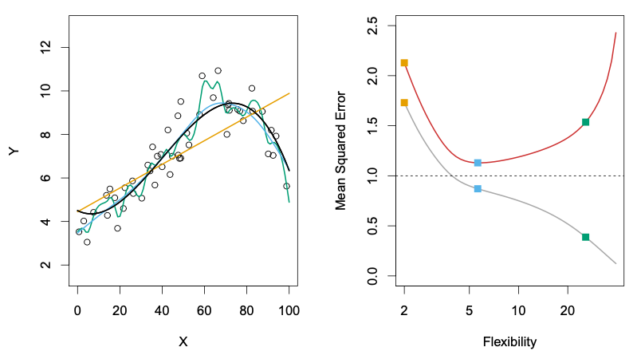

# Model Complexity

## Overfitting

Last week, we discussed as the model learns from any data, it will learn to recognize its patterns, and sometimes it will recognize patterns that are only specific to this data and not reproducible anywhere else. This is called **Overfitting**, and why we constructed the **training** and **testing** datasets to identify this phenomena.

Let's look about overfitting in more detail: there can be different magnitudes of overfitting. The more flexible models we employ, the higher risk there will be overfitting, because these models will identify patterns too specific to the training data and not generalize to the test data. For instance, linear regression is a fairly inflexible approach, because it just uses a straight line to model the data. However, if we use polynomial regression, especially for higher degree polynomials, the model becomes more flexible, with a higher risk of overfitting.

Let's take a look at our first model again:

$$
MeanBloodPressure= \beta_0 + \beta_1 \cdot Age
$$

```{python}
import pandas as pd
import seaborn as sns
import numpy as np
from sklearn.model_selection import train_test_split, cross_val_score, cross_val_predict
from sklearn.metrics import mean_squared_error
import matplotlib.pyplot as plt
from formulaic import model_matrix
from sklearn import linear_model
import statsmodels.api as sm

nhanes = pd.read_csv("classroom_data/NHANES.csv")
nhanes.drop_duplicates(inplace=True)
nhanes['MeanBloodPressure'] = nhanes['BPDiaAve'] + (nhanes['BPSysAve'] - nhanes['BPDiaAve']) / 3 

#Use a small part of the data to illlustrate overfitting.
nhanes_tiny = nhanes.sample(n=300, random_state=2)

y, X = model_matrix("MeanBloodPressure ~ BMI", nhanes_tiny)

X_train, X_test, y_train, y_test = train_test_split(X, y, test_size=0.5, random_state=42)

linear_reg = linear_model.LinearRegression().fit(X_train, y_train)
y_train_predicted = linear_reg.predict(X_train)
y_test_predicted = linear_reg.predict(X_test)
train_err = mean_squared_error(y_train_predicted, y_train)
test_err = mean_squared_error(y_test_predicted, y_test)

plt.clf()
fig, (ax1, ax2) = plt.subplots(2, layout='constrained')

ax1.plot(X_train.BMI, y_train_predicted, label="fitted line")
ax1.scatter(X_train.BMI, y_train, alpha=.5, color="brown", label="Training set")
ax1.set(xlabel='BMI', ylabel='Mean Blood Pressure')
ax1.set_xlim(np.min(nhanes_tiny.BMI), np.max(nhanes_tiny.BMI))
ax1.set_ylim(np.min(nhanes_tiny.MeanBloodPressure), np.max(nhanes_tiny.MeanBloodPressure))
ax1.set_title('Training Error: ' + str(round(train_err, 2)))

ax2.plot(X_test.BMI, y_test_predicted, label="fitted line")
ax2.scatter(X_test.BMI, y_test, alpha=.5, color="brown", label="Testing set")
ax2.set(xlabel='BMI', ylabel='Mean Blood Pressure')
ax2.set_xlim(np.min(nhanes_tiny.BMI), np.max(nhanes_tiny.BMI))
ax2.set_ylim(np.min(nhanes_tiny.MeanBloodPressure), np.max(nhanes_tiny.MeanBloodPressure))
ax2.set_title('Testing Error: ' + str(round(test_err, 2)))

plt.show()
```

We see that Training Error \< Testing Error.

Let's look at what happens if we increase the flexibility of the model by fitting it with a degree 2 polynomial:

```{python}
p_degree = 2
y, X = model_matrix("MeanBloodPressure ~ poly(BMI, degree=" + str(p_degree) + ", raw=True)", nhanes_tiny)

X_train, X_test, y_train, y_test = train_test_split(X, y, test_size=0.5, random_state=42)

linear_reg = linear_model.LinearRegression().fit(X_train, y_train)
y_train_predicted = linear_reg.predict(X_train)
y_test_predicted = linear_reg.predict(X_test)
train_err = mean_squared_error(y_train_predicted, y_train)
test_err = mean_squared_error(y_test_predicted, y_test)

plt.clf()
fig, (ax1, ax2) = plt.subplots(2, layout='constrained')

ax1.scatter(X_train[X_train.columns[1]], y_train, alpha=.5, color="brown", label="Training set")
ax1.scatter(X_train[X_train.columns[1]], y_train_predicted, label="fitted line")
ax1.set(xlabel='BMI', ylabel='Mean Blood Pressure')
ax1.set_title('Training Error: ' + str(round(train_err, 2)))
ax1.set_xlim(np.min(nhanes_tiny.BMI), np.max(nhanes_tiny.BMI))
ax1.set_ylim(np.min(nhanes_tiny.MeanBloodPressure), np.max(nhanes_tiny.MeanBloodPressure))

ax2.scatter(X_test[X_test.columns[1]], y_test, alpha=.5, color="brown", label="Testing set")
ax2.scatter(X_test[X_test.columns[1]], y_test_predicted, label="fitted line")
ax2.set(xlabel='BMI', ylabel='Blood Pressure')
ax2.set_title('Testing Error: ' + str(round(test_err, 2)))
ax2.set_xlim(np.min(nhanes_tiny.BMI), np.max(nhanes_tiny.BMI))
ax2.set_ylim(np.min(nhanes_tiny.MeanBloodPressure), np.max(nhanes_tiny.MeanBloodPressure))

fig.suptitle('Polynomial Degree: ' + str(p_degree))
plt.show()
```

We see that both Training and Testing error both decreased slightly!

What happens if we keep increasing the model complexity?

```{python}
for p_degree in [4, 10]:
  y, X = model_matrix("MeanBloodPressure ~ poly(BMI, degree=" + str(p_degree) + ", raw=True)", nhanes_tiny)
  
  X_train, X_test, y_train, y_test = train_test_split(X, y, test_size=0.5, random_state=42)
  
  linear_reg = linear_model.LinearRegression().fit(X_train, y_train)
  y_train_predicted = linear_reg.predict(X_train)
  y_test_predicted = linear_reg.predict(X_test)
  train_err = mean_squared_error(y_train_predicted, y_train)
  test_err = mean_squared_error(y_test_predicted, y_test)
  
  plt.clf()
  fig, (ax1, ax2) = plt.subplots(2, layout='constrained')
  
  ax1.scatter(X_train[X_train.columns[1]], y_train, alpha=.5, color="brown", label="Training set")
  ax1.scatter(X_train[X_train.columns[1]], y_train_predicted, label="fitted line")
  ax1.set(xlabel='BMI', ylabel='Mean Blood Pressure')
  ax1.set_title('Training Error: ' + str(round(train_err, 2)))
  ax1.set_xlim(np.min(nhanes_tiny.BMI), np.max(nhanes_tiny.BMI))
  ax1.set_ylim(np.min(nhanes_tiny.MeanBloodPressure), np.max(nhanes_tiny.MeanBloodPressure))

  ax2.scatter(X_test[X_test.columns[1]], y_test, alpha=.5, color="brown", label="Testing set")
  ax2.scatter(X_test[X_test.columns[1]], y_test_predicted, label="fitted line")
  ax2.set(xlabel='BMI', ylabel='Mean Blood Pressure')
  ax2.set_title('Testing Error: ' + str(round(test_err, 2)))
  ax2.set_xlim(np.min(nhanes_tiny.BMI), np.max(nhanes_tiny.BMI))
  ax2.set_ylim(np.min(nhanes_tiny.MeanBloodPressure), np.max(nhanes_tiny.MeanBloodPressure))

  fig.suptitle('Polynomial Degree: ' + str(p_degree))
  plt.show()

```

The training error decreased more, but the testing error increased!

Let's summarize it:

```{python}
train_err = []
test_err = []
polynomials = list(range(1, 10))

for p_degree in polynomials:
  if p_degree == 1:
    y, X = model_matrix("MeanBloodPressure ~ BMI", nhanes_tiny)
  else:
    y, X = model_matrix("MeanBloodPressure ~ poly(BMI, degree=" + str(p_degree) + ")", nhanes_tiny)
  X_train, X_test, y_train, y_test = train_test_split(X, y, test_size=0.5, random_state=42)
  
  linear_reg = linear_model.LinearRegression().fit(X_train, y_train)
  y_train_predicted = linear_reg.predict(X_train)
  y_test_predicted = linear_reg.predict(X_test)
  train_err.append(mean_squared_error(y_train_predicted, y_train))
  test_err.append(mean_squared_error(y_test_predicted, y_test))
  
plt.clf()
plt.plot(polynomials, train_err, color="blue", label="Training Error")
plt.plot(polynomials, test_err, color="red", label="Testing Error")
plt.xlabel('Polynomial Degree')
plt.ylabel('Error')
plt.legend()
plt.show()  

```

As our Polynomial Degree increased, the following happened:

-   In the linear model, we see that the Training Error is fairly high, and the Testing Error is even higher. This makes sense, as the model does not generalize as well to the testing set.

-   As the degrees increased, both training and testing error decreased slightly.

-   After degree 4, we see that the Training Error continued to decrease, but the Testing Error blew up! This is an example of **Overfitting**, in which our model fitted the shape of of the training set so well that it fails to generalize to the testing set at all.

We want to find a model that is "just right" that doesn't underfit or overfit the data. Usually, as the model becomes more flexible, the Training Error keeps lowering, and the Testing Error will lower a bit before increasing. It seems that our ideal prediction model is around a polynomial of degree 4, with the minimal Testing Error.

### Another example

Here is another illustration of the phenomena, using synthetic controlled data:

On the left shows the Training Data in black dots. Then, three models are displayed: linear regression (orange line), two other models of increasing complexity in blue and green.

On the right shows the training error (grey curve), testing error (red curve), and where each of the three models on the left land in the error rate with their respective colors. We see that as the flexibility of the model increased, the training error in grey decreased, but the testing error decreased for a bit before going up.

{width="500"}

Hopefully you start to see the importance of examining the Testing Error instead of the Training Error to evaluate our model. A highly flexible data will overfit the model and make it seem like the Training Error is small, but it will not generalize to the Testing data, which will have Testing Error.

## Bias Variance Trade-off

Another way to describe the underfitting/overfitting phenoma is via the terminology "**Bias-Variance Trade-off".** It breaks down our Testing Error by the following:

$$\text{testing error} = \text{bias} + \text{variance} + \text{irreducible error}$$

Suppose that we have a **population** of data that is out in the wild. We collect a **sample** as our training data set to build a model $f_1()$, and suppose that we then sample *several* *training* *datasets* and build models $f_2(), … f_n()$ with the same model specifications, but each of the models have slightly different learned parameters due to sampling differences. Then, suppose we evaluate each of these models on one single testing dataset, and look at the following

-   The *average* error of our model predictions from $f_1(), …, f_n()$ vs. the true out come in the testing set. This is called **bias**. Visually, this is how snug our models are to the testing data on average.

-   The amount by our model changed between $f_1(), …, f_n()$. This is called **variance**. Ideally the estimate for our $f()$ should not vary too much between training sets, (low variance), but some models are very sensitive to small changes in our training data (high variance).

-   **Irreducible error** refers to the natural limitation of a model to perfectly fit the testing set.

Machine learning theory states that:

-   When there is model underfitting, the testing error exhibits high bias but low variance.

    -   Simple models such as linear regression with a small amount of predictors tend to underfit a model due to the fact that most data don't exhibit a true linear relationship, but they tend to have low variance because the model is not sensitive to small changes in our data, unless it is an outlier.

-   When there is model overfitting, the testing error exhibits low bias but high variance.

    -   More complex models, such as linear regression with polynomial terms or high number of predictors have a higher tendency to overfit the model. This creates a tight fit to the training data, and if it generalizes well enough, will lead to a small bias on the testing data. However, because of the tight fit to training data, there will probably be higher variation in the model parameters across different realizations of the model.

We try to find a model that minimizes the testing error by finding a balance of bias vs. variance.

## Cross-Validation

When we try out various predictors or polynomial expansions of predictors, we evaluate our model performance on the Test Set, which is our gold standard of seeing how well our model generalize to unseen data to avoid **overfitting**.

Recall that we should not have the model know anything about the Testing Set as we develop the model. We use the Test Set to make sure that the model did not pick up patterns only specific to the Training Set. However, there's a catch-22 to this: the more we evaluate new models on the Test Set, we start to fit our model to the Test Set!

What can we do? We could create a third subset of data called the **Validation Set** in which we fit a model on the Training Set, then see what the model performance is on the Validation Set. Then, we try to fit a different model on the Training Set, and evaluate it again on the Validation Set. We pick the best performing model from the Validation Set, and then evaluate the final model on the Test Set. That is a very reasonable approach, but costly to the number of samples we have to use in our model building.

Here's a popular solution: Instead of creating a Validation Set, we stick to our Training and Testing Sets, but in our Training Set, we set up a **K-Fold Cross Validation** process. The Training Set is partitioned into $k$ small sets (called "**K folds**"). As an example, let's suppose $k=5$. Here is what happens next:

-   We decide on a particular model with appropriate predictors and any polynomial expansions.

-   The model is trained on the folds 2-5. Then, evaluate the model on the fold that was not used: the 1st fold.

-   Permute to the next set of 4 folds: The same model speficication is trained on folds 1, 3, 4, 5, and is evaluated on the 2nd fold.

-   Permute to the next set of 4 folds: The same model specification is trained on folds 1, 2, 4, 5 and is evaluated on the 3rd fold. And so on.

-   When finished, take the average of the evaluations: this is the average performance for our model.

{alt="Image source: https://scikit-learn.org/stable/modules/cross_validation.html" width="500"}

Within just the Training Set, we have partitioned it into smaller parts and reused it in an effective way that the training data never touches the evaluation data for each model. We create 5 models along the way, and we take the average of their performance as our overall performance. This is a super efficient way to evaluate the model without touching the Test Set or creating a Validation Set.

Let's see how we can do that for 5-Fold Cross Validation:

```{python}
p_degree = 2
y, X = model_matrix("MeanBloodPressure ~ poly(BMI, degree=" + str(p_degree) + ", raw=True)", nhanes_tiny)

X_train, X_test, y_train, y_test = train_test_split(X, y, test_size=0.5, random_state=42)

linear_reg = linear_model.LinearRegression()
scores = cross_val_score(linear_reg, X_train, y_train, cv=5, scoring="neg_mean_squared_error")

-scores
```

We take the average of the 5-fold performances:

```{python}
-np.mean(scores)
```

We can also get the prediction that was obtained for that element when it was in the evaluation set, so we can visualize the predicted values in the Training Set.

```{python}
y_train_predicted = cross_val_predict(linear_reg, X_train, y_train, cv=5)

plt.clf()

plt.scatter(X_train[X_train.columns[1]], y_train_predicted, label="fitted line")
plt.scatter(X_train[X_train.columns[1]], y_train, alpha=.5, color="brown", label="Training set")
plt.xlabel('BMI')
plt.ylabel('Mean Blood Pressure')
plt.xlim(np.min(nhanes_tiny.BMI), np.max(nhanes_tiny.BMI))
plt.ylim(np.min(nhanes_tiny.MeanBloodPressure), np.max(nhanes_tiny.MeanBloodPressure))
plt.show()
```

## Cubic Splines

To see another use of Cross Validation, let's look at variations of polynomial regression. Sometimes, polynomials are not sufficient to capture the non-linearity of the data: polynomials of degrees 2-4 tend to be useful, but after degree 4, often the shape of the polynomial isn't flexible enough - it often leads to higher Variance in the Bias-Variance decomposition. Rather, people started to explore building a regression from pieces of polynomials, called **Piecewise Polynomial Regression**. For instance, instead of a degree 3 (Cubic) polynomial:

$$
Y = \beta_0 + \beta_1 \cdot X + \beta_2 \cdot X^2 + \beta_3 \cdot X^3
$$

We split it into two sections at a breakpoint $c$:

$$
 Y = \begin{cases}
      \beta_{01} + \beta_{11} \cdot X + \beta_{21} \cdot X^2 + \beta_{31} \cdot X^3 & \text{if $X < c$}\\
      \beta_{02}+ \beta_{12} \cdot X + \beta_{22} \cdot X^2 + \beta_{32} \cdot X^3 & \text{if $X \ge c$}\\
    \end{cases} 
$$

This is a Piecewise Cubic Regression, an example can be seen in the top panel of this figure:


Here, we end up using 8 predictors for our model. We see something that looks off immediately: our model is not continuous at the cutoff point! To fix the problem, we can constrain our model to be continuous: we require that the first and second derivatives of the piecewise polynomials to be continuous at the cutoff point. This fix is shown in the bottom panel, which is called **Cubic Spline Regression**. We can increase the number of cutoff points as we like in a piecewise or spline model. This cubic spline model uses $K + 4$ predictors, where $K$ is the number of cutoff points used.

To pick the number of cutoff points, we can also perform cross validation:

## Appendix: Small datasets

AIC, BIC, C_p

## Exercises

Exercises for week 4 can be found [here](#).
