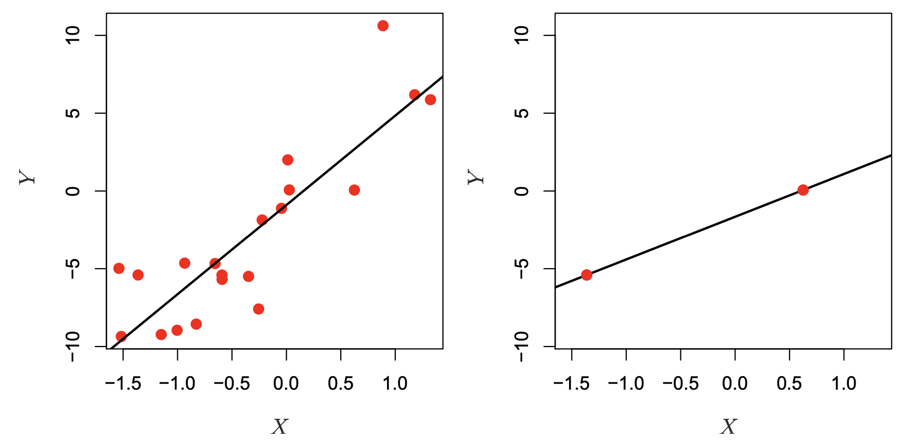

# Model Complexity

## Overfitting

In the first week, we discussed as the model learns from any data, it will learn to recognize its patterns, and sometimes it will recognize patterns that are only specific to this data and not reproducible anywhere else. This is called **Overfitting**, and why we constructed the **training** and **testing** datasets to identify and safeguard against this phenomena. We will look at two common situations of Overfitting: over-use of predictors, and overly-flexible polynomial models.

### Over-use of predictors

One way to increase the risk of Overfitting is to use a large amount of predictors in the model relative to the number of samples. When number of predictors approach the number of samples, the model becomes increasingly flexible: it can perform an almost perfect fit of the training data *regardless whether the predictors are related to the outcome*, but may perform quite poorly on the testing data. When the number of predictors *exceed* the number of samples, the model will always perfectly fit on training data with no training error, which is a problem called **High Dimensional Problems** in which we will address next week.

Why does this happen? Imagine that we have two samples, and one single predictor $X$ to predict response $Y$. In a Linear Regression setting, we would be estimating two $\beta$ parameters: $Y = \beta_0 + \beta_1 \cdot X$, so this is an example where the number of parameters to be estimated is equal the number of samples. Well, two samples on a two dimensional space define an unique line, so we can get a perfect model fit in the right hand panel in the figure below. This model would have zero error on the Training Data, but we don't know how it might generalize to the Testing Data.

Whereas, if we had more samples, we would see a scenario on the left panel below, where there is a more less flexible, imperfect model. Sometimes less flexible, imperfect models are more useful, as they capture the average shape of the Training Data that generalize better to the Test Set.

{width="500"}

In our NHANES dataset, let's see what happens if we just start piling on predictors for our model, without considering whether the predictors are useful or not.

```{python}
import pandas as pd
import seaborn as sns
import numpy as np
from sklearn.model_selection import train_test_split, cross_val_score, cross_val_predict
from sklearn.metrics import mean_squared_error
import matplotlib.pyplot as plt
from formulaic import model_matrix
from sklearn import linear_model
import statsmodels.api as sm

nhanes = pd.read_csv("classroom_data/NHANES.csv")
nhanes.drop_duplicates(inplace=True)
nhanes['MeanBloodPressure'] = nhanes['BPDiaAve'] + (nhanes['BPSysAve'] - nhanes['BPDiaAve']) / 3 

#Use a small part of the data to illlustrate overfitting.
nhanes_tiny = nhanes.sample(n=300, random_state=2)

train_err = []

test_err = []
# We pick predictors that don't have too much missing data and just start adding predictors to our model:
nhanes_tiny2 = nhanes.loc[:, ["MeanBloodPressure", "Gender", "Age", "Race1", "Education", "MaritalStatus", "Poverty", "HomeRooms", "HomeOwn", "Work", "BMI", "Pulse", "DirectChol", "TotChol", "UrineVol1", "UrineVol2", "Diabetes", "HealthGen", "SleepHrsNight"]]
y, X = model_matrix("MeanBloodPressure ~ .", nhanes_tiny2)

predictors_to_iterate = list(range(1, X.shape[1]))

for n_predictors in predictors_to_iterate:
  Xtemp = X.iloc[:, :n_predictors]
  X_train, X_test, y_train, y_test = train_test_split(Xtemp, y, test_size=0.5, random_state=42)
  linear_reg = linear_model.LinearRegression().fit(X_train, y_train)
  y_train_predicted = linear_reg.predict(X_train)
  y_test_predicted = linear_reg.predict(X_test)
  train_err.append(mean_squared_error(y_train_predicted, y_train))
  test_err.append(mean_squared_error(y_test_predicted, y_test))
  
plt.clf()
plt.plot(predictors_to_iterate, train_err, color="blue", label="Training Error")
plt.plot(predictors_to_iterate, test_err, color="red", label="Testing Error")
plt.xlabel('Number of Predictors')
plt.ylabel('Error')
plt.legend()
plt.show()  
```

The number of samples used is 300, and as we increased the number of predictor to 30, we see that the training error keeps dropping, but the optimal testing error was something around 5-10 predictors. That suggests using too many predictors created a model that was too flexible to the Training but not the Testing dataset.

### Overly-flexible polynomial models

Generally, the more flexible models we employ, the higher risk there will be Overfitting, because these models will identify patterns too specific to the training data and not generalize to the test data. An example of an overly-flexible model is to use a high number of predictors relative to the number of samples. Another example of this situation is when we use polynomial regression with increasingly higher order terms. The models become more flexible because we are increasing the number of predictors used in the polynomial expansion, and visually, they model looks increasingly flexible to any model pattern.

Let's look at an example data, split into Training and Testing data:

```{python}
import numpy as np
import matplotlib.pyplot as plt
from sklearn.model_selection import train_test_split
from sklearn.preprocessing import PolynomialFeatures
from sklearn.linear_model import LinearRegression
from sklearn.metrics import mean_squared_error

# Generate synthetic data
np.random.seed(0)
x = np.linspace(0, 10, 100)
y = np.sin(x) + np.random.normal(scale=0.2, size=x.shape)

# Split data into training and testing sets
x_train, x_test, y_train, y_test = train_test_split(x, y, test_size=0.3, random_state=0)

plt.clf()
fig, (ax1, ax2) = plt.subplots(2, layout='constrained')

ax1.scatter(x_train, y_train, color='blue')
ax1.set_title("Training Set")
ax1.set(xlabel='', ylabel='Response')

ax2.scatter(x_test, y_test, color='blue')
ax2.set_title("Testing Set")
ax2.set(xlabel='Predictor', ylabel='Response')

plt.show()

```

Then, we fit models of increasing flexibility via increasing polynomial terms. Look at each model fit: does the model fit well to the training set and test set? When does it generalize well, and when does it not?

```{python}
# Fit polynomial regression models of different degrees

degrees = range(1, 21)
train_errors = []
test_errors = []
for degree in degrees:
    poly_features = PolynomialFeatures(degree=degree)
    x_poly_train = poly_features.fit_transform(x_train[:, np.newaxis])
    x_poly_test = poly_features.transform(x_test[:, np.newaxis])
    
    model = LinearRegression()
    model.fit(x_poly_train, y_train)
    
    train_predictions = model.predict(x_poly_train)
    test_predictions = model.predict(x_poly_test)
    
    train_errors.append(mean_squared_error(y_train, train_predictions))
    test_errors.append(mean_squared_error(y_test, test_predictions))
    
    if degree == 1 or degree == 3 or degree == 6 or degree == 20:
      plt.clf()
      fig, (ax1, ax2) = plt.subplots(2, layout='constrained')
      ax1.scatter(x_train, y_train, color='blue')
      ax1.scatter(x_train, train_predictions, color='red')
      ax1.set_title("Training Set on Degree " + str(degree) + " polynomial")
      ax1.set(xlabel='', ylabel='Response')
      
      ax2.scatter(x_test, y_test, color='blue')
      ax2.scatter(x_test, test_predictions, color='red')
      ax2.set(xlabel='Predictor', ylabel='Response')
      ax2.set_title("Testing Set on Degree " + str(degree) + " polynomial")
      
      plt.show()

```

Then, we look at the Training and Testing error for each polynomial degree:

```{python}
# Plot learning curves
plt.figure(figsize=(10, 6))
plt.plot(degrees, train_errors, label='Train Error', marker='o')
plt.plot(degrees, test_errors, label='Test Error', marker='o')
plt.title('Learning Curves')
plt.xlabel('Polynomial Degree')
plt.ylabel('Mean Squared Error')
plt.xticks(degrees)
plt.legend()
plt.show()
```

We see that our Testing Error is always higher than the Training Error. That makes sense.

As our Polynomial Degree increased, the following happened:

-   As the degrees increased, both training and testing error decreased.

-   After degree 10, we see that the Training Error remained mostly low, but the Testing Error blew up! This is an example of **Overfitting**, in which our model fitted the shape of of the training set so well that it fails to generalize to the testing set at all.

Usually, as the model becomes more flexible, the Training Error remains the same or keeps lowering, and the Testing Error will lower a bit before increasing. It seems that our ideal prediction model a polynomial of degree 10, with the minimal Testing Error.

## Bias-Variance Trade-off

Another way to describe the overfitting phenoma is via the theory "**Bias-Variance Trade-off".** It breaks down our Testing Error of a single model by the following:

$$\text{testing error} = \text{bias} + \text{variance} + \text{irreducible error}$$

Suppose that we have a **population** of data that is out in the wild. We collect a **sample** as our training data set to build a model $f_1()$, and suppose that we then sample *several* more *training* *datasets* to build models $f_2(), … f_n()$ with the same model specifications, but each of the models have slightly different learned parameters due to sampling differences. Then, suppose we evaluate each of these models on one single testing dataset, and look at the following

-   The *average* error of our model predictions from $f_1(), …, f_n()$ vs. the true out come in the testing set. This is called **bias**. Visually, this is how snug our models are to the testing data on average.

-   The amount by our model changed between $f_1(), …, f_n()$. This is called **variance**. Ideally the estimate for our $f()$ should not vary too much between training sets, (low variance), but some models are very sensitive to small changes in our training data (high variance).

-   **Irreducible error** refers to the natural limitation of a model to perfectly fit the testing set.

Machine Learning theory states that:

-   When there is model underfitting, the testing error exhibits high bias but low variance.

    -   Simple, inflexible models such as linear regression with a small amount of predictors tend to underfit a model due to the fact that most data don't exhibit a true linear relationship, but they tend to have low variance because the model is not sensitive to small changes in our data, unless there are outliers.

-   When there is model overfitting, the testing error exhibits low bias but high variance.

    -   More complex models, such as linear regression with polynomial terms or high number of predictors, have a higher tendency to overfit the model. This creates a tight fit to the training data, and if it generalizes well enough, will lead to a small bias on the testing data. However, because of the tight fit to training data, there will probably be higher variation in the model parameters across different realizations of the model.

Here is an [excellent animation](https://mlu-explain.github.io/bias-variance/) that illustrates overfitting and bias-variance trade-off.

## Cross-Validation

When we try out various predictors or polynomial expansions of predictors, we evaluate our model performance on the Test Set, which is our gold standard of seeing how well our model generalize to unseen data to avoid **overfitting**.

Recall that we should not have the model know anything about the Testing Set as we develop the model. We use the Test Set to make sure that the model did not pick up patterns only specific to the Training Set. However, there's a catch-22 to this: the more we evaluate new models on the Test Set, our brain starts to know what models perform well on the Test Set, which influences what models are used! For instance, the more predictors we try out on the training set and evaluate on the testing set, then the more we have learned about the testing set and thus starting to fit our model to the test set...yes, what our own brain knows about the test set has an impact of how we choose a model, which ultimately leads to overfitting!

What can we do? We could create a third subset of data called the **Validation Set** in which we fit a model on the Training Set, then see what the model performance is on the Validation Set. Then, we try to fit a different model on the Training Set, and evaluate it again on the Validation Set. We pick the best performing model from the Validation Set, and then evaluate the final model on the Test Set. That is a very reasonable approach, but costly to the number of samples we have to use in our model building.

Here's a popular solution: Instead of creating a Validation Set, we stick to our Training and Testing Sets, but in our Training Set, we set up a **K-Fold Cross Validation** process. The Training Set is partitioned into $k$ small sets (called "**K folds**"). As an example, let's suppose $k=5$. Here is what happens next:

-   We decide on a particular model with appropriate predictors and any polynomial expansions.

-   The model is trained on the folds 2-5. Then, evaluate the model on the fold that was not used: the 1st fold.

-   Permute to the next set of 4 folds: The same model specification is trained on folds 1, 3, 4, 5, and is evaluated on the 2nd fold.

-   Permute to the next set of 4 folds: The same model specification is trained on folds 1, 2, 4, 5 and is evaluated on the 3rd fold. And so on.

-   When finished, take the average of the evaluations: this is the average performance for our model.

{width="500"}

Within just the Training Set, we have partitioned it into smaller parts and reused it in an effective way that the training data never touches the evaluation data for each model. We create 5 models along the way, and we take the average of their performance as our overall performance. This is a super efficient way to evaluate the model without touching the Test Set or creating a Validation Set.

Suppose that we want predict $MeanBloodPressure$ using the predictor $BMI$ via polynomial regression, and we are trying to decide what degree polynomial we want to use: we are going to consider polynomial degrees 2, 3, and 4. This is how we would do it in a 5-fold Cross Validation framework:

1.  Fit a model of polynomial degree 2 in a 5-fold Cross Validation on the Training Set. Take the average of its performance.
2.  Fit a model of polynomial degree 3 in a 5-fold Cross Validation on the Training Set. Take the average of its performance.
3.  Fit a model of polynomial degree 4 in a 5-fold Cross Validation on the Training Set. Take the average of its performance.
4.  Compare the average performances of the three models.
5.  Evaluate the most promising model on the Test Set.

Below is Step 1:

```{python}
p_degree = 2

y, X = model_matrix("MeanBloodPressure ~ poly(BMI, degree=" + str(p_degree) + ", raw=True)", nhanes_tiny)

X_train, X_test, y_train, y_test = train_test_split(X, y, test_size=0.5, random_state=42)

linear_reg_poly2 = linear_model.LinearRegression()
scores = cross_val_score(linear_reg_poly2, X_train, y_train, cv=5, scoring="neg_mean_squared_error")

-np.mean(scores)
```

We can also get the prediction that was obtained for that element when it was in the evaluation set, so we can visualize the predicted values in the Training Set.

```{python}
y_train_predicted = cross_val_predict(linear_reg_poly2, X_train, y_train, cv=5)

plt.clf()

plt.scatter(X_train[X_train.columns[1]], y_train_predicted, label="fitted line")
plt.scatter(X_train[X_train.columns[1]], y_train, alpha=.5, color="brown", label="Training set")
plt.xlabel('BMI')
plt.ylabel('Mean Blood Pressure')
plt.xlim(np.min(nhanes_tiny.BMI), np.max(nhanes_tiny.BMI))
plt.ylim(np.min(nhanes_tiny.MeanBloodPressure), np.max(nhanes_tiny.MeanBloodPressure))
plt.show()
```

Step 2:

```{python}
p_degree = 3

y, X = model_matrix("MeanBloodPressure ~ poly(BMI, degree=" + str(p_degree) + ", raw=True)", nhanes_tiny)

X_train, X_test, y_train, y_test = train_test_split(X, y, test_size=0.5, random_state=42)

linear_reg_poly3 = linear_model.LinearRegression()
scores = cross_val_score(linear_reg_poly3, X_train, y_train, cv=5, scoring="neg_mean_squared_error")

-np.mean(scores)
```

Step 3:

```{python}
p_degree = 4

y, X = model_matrix("MeanBloodPressure ~ poly(BMI, degree=" + str(p_degree) + ", raw=True)", nhanes_tiny)

X_train, X_test, y_train, y_test = train_test_split(X, y, test_size=0.5, random_state=42)

linear_reg_poly4 = linear_model.LinearRegression()
scores = cross_val_score(linear_reg_poly4, X_train, y_train, cv=5, scoring="neg_mean_squared_error")

-np.mean(scores)
```

It looks like the degree-2 polynomial had the lowest error in Cross Validation. Let's evaluate this model on the Test Set:

```{python}
y_test_predicted = linear_reg_poly4.fit(X_train, y_train).predict(X_test)
mean_squared_error(y_test_predicted, y_test)
```

## Appendix: Cubic Splines

To see another use of Cross Validation, let's look at variations of polynomial regression. Sometimes, polynomials are not sufficient to capture the non-linearity of the data: polynomials of degrees 2-4 tend to be useful, but after degree 4, often the shape of the polynomial isn't flexible enough - it often leads to higher Variance in the Bias-Variance decomposition. Rather, people started to explore building a regression from pieces of polynomials, called **Piecewise Polynomial Regression**. For instance, instead of a degree 3 (Cubic) polynomial:

$$
Y = \beta_0 + \beta_1 \cdot X + \beta_2 \cdot X^2 + \beta_3 \cdot X^3
$$

We split it into two sections at a breakpoint $c$:

$$
 Y = \begin{cases}
      \beta_{01} + \beta_{11} \cdot X + \beta_{21} \cdot X^2 + \beta_{31} \cdot X^3 & \text{if $X < c$}\\
      \beta_{02}+ \beta_{12} \cdot X + \beta_{22} \cdot X^2 + \beta_{32} \cdot X^3 & \text{if $X \ge c$}\\
    \end{cases} 
$$

This is a Piecewise Cubic Regression, an example can be seen in the top panel of this figure:


Here, we end up using 8 predictors for our model. We see something that looks off immediately: our model is not continuous at the cutoff point! To fix the problem, we can constrain our model to be continuous: we require that the first and second derivatives of the piecewise polynomials to be continuous at the cutoff point. This fix is shown in the bottom panel, which is called **Cubic Spline Regression**. We can increase the number of cutoff points as we like in a piecewise or spline model. This cubic spline model uses $K + 4$ predictors, where $K$ is the number of cutoff points used.

To pick the number of cutoff points, we can also perform cross validation.

For 10 cutoff points, here is the cross validation result:

```{python}
y, X = model_matrix("MeanBloodPressure ~ BMI + cs(BMI, df=10)", nhanes_tiny)

X_train, X_test, y_train, y_test = train_test_split(X, y, test_size=0.5, random_state=42)

linear_reg = linear_model.LinearRegression()
scores = cross_val_score(linear_reg, X_train, y_train, cv=5, scoring="neg_mean_squared_error")

-scores
-np.mean(scores)
```

For 5 cutoff points, here is the cross validation result:

```{python}
y, X = model_matrix("MeanBloodPressure ~ BMI + cs(BMI, df=5)", nhanes_tiny)

X_train, X_test, y_train, y_test = train_test_split(X, y, test_size=0.5, random_state=42)

linear_reg = linear_model.LinearRegression()
scores = cross_val_score(linear_reg, X_train, y_train, cv=5, scoring="neg_mean_squared_error")

-scores
-np.mean(scores)
```

Looks like 5-cutoff points is better. We then use this model to visualize with the training data:

```{python}
y_train_predicted = cross_val_predict(linear_reg, X_train, y_train, cv=5)

plt.clf()

plt.scatter(X_train[X_train.columns[1]], y_train_predicted, label="fitted line")
plt.scatter(X_train[X_train.columns[1]], y_train, alpha=.5, color="brown", label="Training set")
plt.xlabel('BMI')
plt.ylabel('Mean Blood Pressure')
plt.xlim(np.min(nhanes_tiny.BMI), np.max(nhanes_tiny.BMI))
plt.ylim(np.min(nhanes_tiny.MeanBloodPressure), np.max(nhanes_tiny.MeanBloodPressure))
plt.show()
```

Finally, how does it do on the test set?

```{python}
y_test_predicted = linear_reg.fit(X_train, y_train).predict(X_test)
mean_squared_error(y_test_predicted, y_test)

```

## Appendix: Small datasets

Throughout this course, we have assumed that we have the luxury to consider a dataset big enough to be split into Training and Testing Sets. There are also situations where the dataset is small where we do not have enough samples to be split into Training and Testing Sets. The dataset is small enough that we need to maximize the number of samples for model fitting, as the model parameters require a sample size large enough to have statistical certainty.

In these scenarios, we only have one dataset to work with. Our standard metric of Mean Squared Error or Mean Absolute Error is likely an underestimate of the real world Mean Squared Error or Mean Absolute Error. This underestimate is going to be more pronounced if the drivers of Overfitting, such as a large number of predictors, or a flexible model is at use.

However, there are metrics that will "adjust" the error to consider the possible amount of overfitting at risk:

-   The **Akaike Information Criterion (AIC)** takes the Mean Squared Error and add a penalty for the number of predictors added. This metric is optimized for prediction and classification uses.

-   The B**ayesican Information Criterion (BIC)** has a similar form as the AIC, but this metric is optimized for inference uses.

For both metrics, you can calculate it after the model fit, and you should pick the model with the lowest AIC or BIC.

These metrics are automatically calculated in the model fits of the `statsmodels` package.

## Exercises

Exercises for week 4 can be found [here](https://colab.research.google.com/drive/14jWAUPI6ieTWs7msPIaKlDvD9FjWOsU5?usp=sharing).
