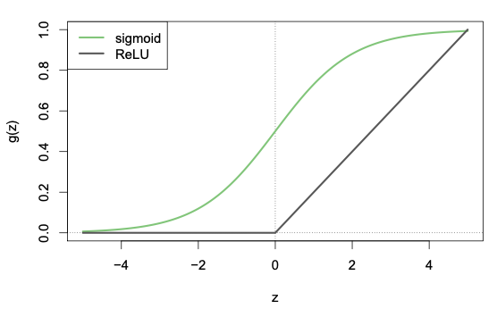
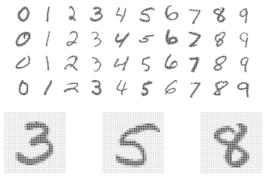
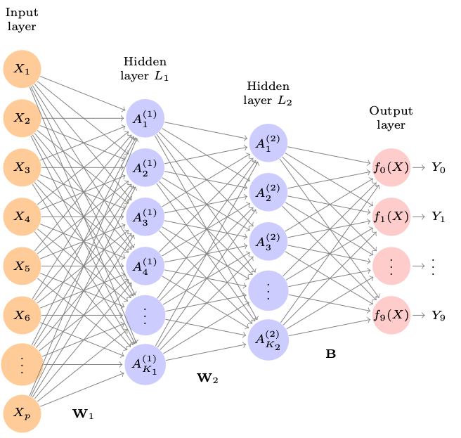
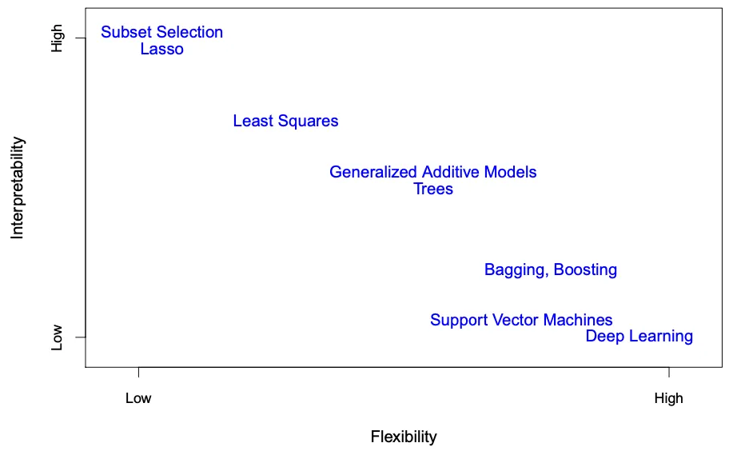

# Neural Networks

The neural network, which was developed in the late 1980s, has now become a cornerstone in modern data science work. For a long time, other machine learning methods performed better than neural networks, so they fell out of favor. However, in the 2010s, neural networks resurfaced due to the larger capacity of computing systems and larger training datasets, and the complexity grew to what became known as **Deep Learning**. Here, we give a light introduction to what neural networks are, and show a few simple implementations in Scikit-Learn. Most mature, large-scale neural networks are implemented in other Python packages, such as [PyTorch](https://pytorch.org/) or [Tensorflow](https://www.tensorflow.org/) that have a very different code syntax than Scikit-Learn and is out of the scope of this course.

## Single Layer Neural Networks

A neural network takes in predictors $X_1$, $X_2$, ..., $X_p$ and builds a *nonlinear* function $f(X)$ to predict a response $Y$. The equation of the model can be quite complex, and it is often depicted using a network diagram such as the one below:

{width="300"}

Each circle in the diagram refers to a variable of in the model, with the arrows indicating a relationship between variables. Therefore, there is a relationship between each one of the $X_i$ predictors and the $Y$ response variable. Each relationship between the variables contributes to a portion of a linear equation. For example, in the diagram above, the following equations are implied:

-   $A_1 = \beta_{1,0} + \beta_{1, 1} \cdot X_1 + \beta_{1, 2} \cdot X_2 + \beta_{1, 3} \cdot X_3 + \beta_{1, 4} \cdot X_4$

-   $A_2 = \beta_{2,0} + \beta_{2, 1} \cdot X_1 + \beta_{2, 2} \cdot X_2 + \beta_{2, 3} \cdot X_3 + \beta_{2, 4} \cdot X_4$

-   . . .

-   $A_5 = \beta_{5,0} + \beta_{5, 1} \cdot X_1 + \beta_{5, 2} \cdot X_2 + \beta_{5, 3} \cdot X_3 + \beta_{5, 4} \cdot X_4$

-   $Y = f(X) = \beta_{6,0} + \beta_{6, 1} \cdot A_1 + \beta_{6, 2} \cdot A_2 + \beta_{6, 3} \cdot A_3 + \beta_{6, 4} \cdot A_4 + \beta_{6, 5} \cdot A_5$

The intermediate variables $A_1$, ..., $A_5$ are called **hidden units** that create additional transformations of the data. By algebraic substitution, we can link the relationship between the response $Y$ with all the $X_1$, ..., $X_4$ predictors. Right now, all these relationship are linear, but in the final model we will have non-linear transformations. To incorproate the non-linear transformations, a transformation $g()$ for each of the equations:

-   $A_1 = g(\beta_{1,0} + \beta_{1, 1} \cdot X_1 + \beta_{1, 2} \cdot X_2 + \beta_{1, 3} \cdot X_3 + \beta_{1, 4} \cdot X_4)$

-   $A_2 = g(\beta_{2,0} + \beta_{2, 1} \cdot X_1 + \beta_{2, 2} \cdot X_2 + \beta_{2, 3} \cdot X_3 + \beta_{2, 4} \cdot X_4)$

-   . . .

-   $A_5 = g(\beta_{5,0} + \beta_{5, 1} \cdot X_1 + \beta_{5, 2} \cdot X_2 + \beta_{5, 3} \cdot X_3 + \beta_{5, 4} \cdot X_4)$

-   $Y = f(X) = g(\beta_{6,0} + \beta_{6, 1} \cdot A_1 + \beta_{6, 2} \cdot A_2 + \beta_{6, 3} \cdot A_3 + \beta_{6, 4} \cdot A_4 + \beta_{6, 5} \cdot A_5)$

This transformation $g()$ has two common forms:

-   A sigmoid transformation, which is the same transformation you saw in the logistic regression model. This is shown in the green curve in the figure below.

-    A rectified linear unit (ReLU) transformation. This is shown in the black curve in the figure below.

{width="350"}

Both transformations are quite popular in neural networks, but the ReLU transformation is easier to compute, so for more larger, complex networks, people tend to use the ReLU transformation. The non-linear transformation create shapes in the neural network model that is unable to be created using linear models.

To fit the neural network model, all the $\beta$s in the equation above are estimated in a way that minimizes the Mean Squared Error, similar to how a Linear Regression minimizes its Mean Squared Error to obtain its optimal parameters.

Here is a tutorial that goes into a bit more depth on the model fitting progress and how it relates to the original linear model we have been working with: [https://lucy.shinyapps.io/neural-net-linear/](https://lucy.shinyapps.io/neural-net-linear/https://lucy.shinyapps.io/neural-net-linear/)

## A modern example

In the 2010s, a big improvement was made in the classification of images due neural networks. A problem that researchers tackled was how to classify people's handwriting. The figure below shows examples of handwritten digits from the "MNIST" dataset. Each grayscale image has 28x28 pixels, each with a 0-255 number showing how dark the pixel is.

{width="300"}

A successful classification neural network model was built with the following schematic structure:

{width="400"}

The input layer has 784 predictors (one for each pixel of an image), and two hidden layers with 256 and 128 predictors. This network has an astounding 235,146 parameters to be learned! In the training process, 60,000 images were used, and the final model was evaluated on 10,000 test images. Note that the sample size is significantly less than the number of parameters to be learned. That is feasible in a neural network setting, but would certainly not work for linear regression models.

One might ask, how does one arrive at such a neural network structure? The answer is that the intuition is built out of careful trial and error via Cross-Validation.

### A Toy Example

Let's load in our high dimensional gene expression - drug sensitivity data back in. We will construct a neural network with all of the genes are predictors, have a hidden layer size of 200, and predict the drug response of Gefitinib.

```{python}
from sklearn.model_selection import train_test_split
from formulaic import model_matrix
from sklearn.linear_model import LogisticRegression
from sklearn.preprocessing import StandardScaler
from sklearn.metrics import mean_squared_error, mean_absolute_error, log_loss, accuracy_score, confusion_matrix, ConfusionMatrixDisplay
import pickle

with open('classroom_data/GEFITINIB_Expression.pickle', 'rb') as handle:
    gefitinib_expression = pickle.load(handle)
    
with open('classroom_data/DOCETAXEL_Expression.pickle', 'rb') as handle:
    docetaxel_expression = pickle.load(handle)
    
gefitinib_expression_train, gefitinib_expression_test = train_test_split(gefitinib_expression, test_size=0.2, random_state=42)

y_train, X_train = model_matrix("GEFITINIB ~ .", gefitinib_expression_train)
y_test, X_test = model_matrix("GEFITINIB ~ .", gefitinib_expression_test)

X_train_scaled = StandardScaler().fit_transform(X_train, y_train)
X_test_scaled = StandardScaler().fit_transform(X_test, y_test)
```

We fit the model with the following settings:

```{python}
from sklearn.neural_network import MLPRegressor

nn = MLPRegressor(hidden_layer_sizes=(200,), random_state=1, max_iter=5000, tol=0.1).fit(X_train_scaled, np.ravel(y_train))
```

Let's examine the learned parameter's dimensions:

```{python}
print(nn.coefs_[0].shape)
print(nn.coefs_[1].shape)
```

We have a matrix of parameters of size 19,213 by 200, and a list of parameters of size 200. That's 3.8 million parameters!

Now, let's see how the model performs on the Test Set:

```{python}
y_test_predicted = nn.predict(X_test_scaled)
test_err = mean_absolute_error(y_test_predicted, y_test)
test_err
```

Let's look at the plot:

```{python}
plt.clf()
plt.scatter(y_test_predicted, y_test, alpha=.5)
plt.axline((.9, .9), slope=1, color='r', linestyle='--')
plt.xlabel('Predicted AUC')
plt.ylabel('True AUC')
plt.title('Mean Absolute Error: ' + str(round(test_err, 2)))
plt.show()
```

That's pretty terrible performance, considering that the True AUC range is from .7 to 1, and the mean absolute error is 1.55!

## When should you use neural networks?

We see laud and hype about deep learning and AI, being deployed to various applications from marketing to biomedical research. As scientists, we need to know when it is appropriate to use a specific type of model. Let's do some reviewing about the models we have explored in this course via this figure below.

{width="500"}

The two axis in the diagram here are as follows:

-   **Flexibility** refers to how specific the model can fit to your Training Data. The more flexible a model is, the more likely it will over-fit to your Training Set. The less flexible a model is, the more likely it will under-fit your Training Set. The appropriate choice of flexibility is *dependent* on your Training and Testing Data. For instance, a highly non-linear dataset may require a very flexible model to get a "just-right" model that minimizes the Testing Error.

-   **Interpretability** refers to how easy it is for the user to understand the learned parameters (referred to be $\beta$ in this course) of the model. For Linear and Logistic regression, there is an direct way to interpret the model, but for a highly non-linear model, such as Deep Learning, it may be much harder. Interpretability was not the focus of this course, but many researchers care about the model interpretability, which relates closely to statistical inference.

Let's see where our models fall on this diagram -- we have some terminology to unpack in the context of this course.

-   **Least Squares** refers to Linear Regression and its close cousin, Logistic Regression. These models are moderately flexible, but if you use too little or too many predictors you may underfitting or overfitting phenomena. These models are quite straightforward to interpret.

-   **Generative Additive Models** are a class of Linear Regression closely related to the Splines Regression you saw in the week 4 exercises. These models are more flexible the Least Squares as they often have nonlinear terms glued together at breakpoints. They are harder to interpret because the nonlinear terms make it harder to explain what the weights are.

-   **Lasso** is a regularization method that is arguably less flexible than Least Squares because the hyperparameter $\lambda$ forces the model to pick a smaller set of predictors, although $\lambda$ can be learned. Because the resulting terms are in a smaller linear or logistic regression form, it is quite easy to interpret. I would personally argue that **lasso** is not substantially different in interpretability and flexibility as Least Squares.

-   **Deep Learning** builds the most complex model compared to the models we have seen so far in this course. It tends to have a massive amount of parameters to learn, and is very flexible to all sorts of non-linear patterns. However, the parameters are very difficult to interpret, although there is active research to develop new metrics to interpret the result of a deep learning model. Usually, because these models are big, they require a huge amount of Training Data to be well trained.

## Appendix: Additional topics we did not touch on in this course

-   Predicting Count Data

-   Supervised vs Unsupervised Learning

-   Statistical Inference

-   Feature Engineering

-   Model Deployment
