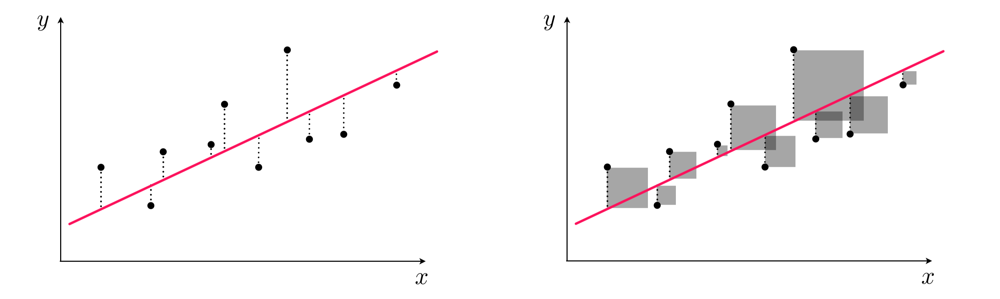
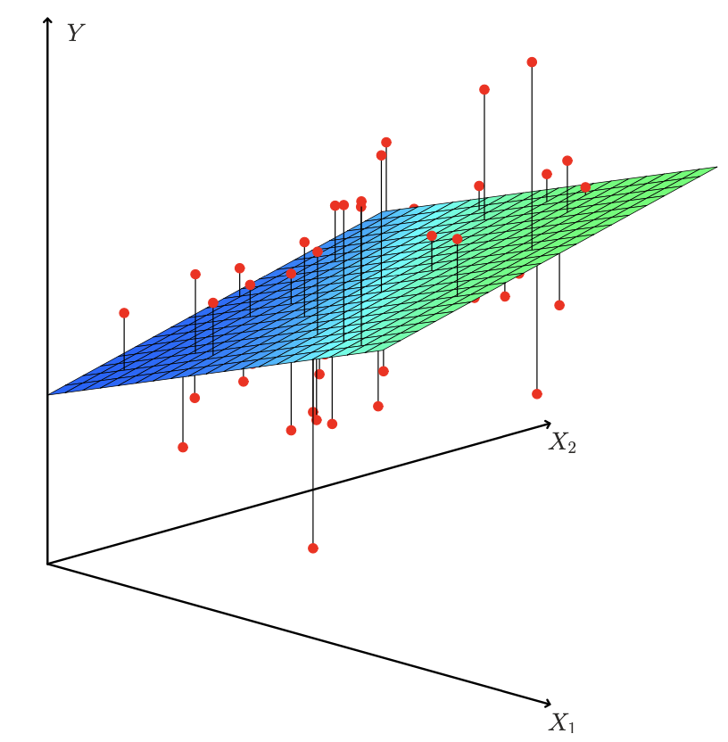
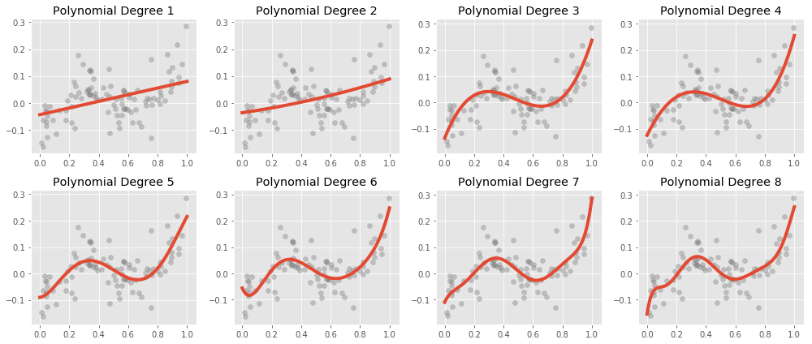

## Insights from Exercise 1?

-   Any need to go over code?

-   What happens if you add a predictor that is poorly correlated to the model? Highly correlated?

-   Did you notice anything about having a low number or higher number of predictors?

-   Did existing scientific knowledge influence your choice of variables?

-   Did missing data affect your model?

## Recall the uses of a ML Model

$$
MeanBloodPressure= \beta_0 + \beta_1 \cdot Age
$$

. . .

1.  Prediction / Classification
2.  Inference

. . .

Terminology review:

-   Predictor

-   Response

-   Parameters / Coefficients

-   Predicted Response

-   True Response

## Linear Regression in depth

Suppose we just use one predictor, $Age$ to predict our outcome $MeanBloodPressure$.

$$
MeanBloodPressure= \beta_0 + \beta_1 \cdot Age
$$

. . .

Our model would look like the following like the red line from our Training data:

```{python}
#| echo: false
import pandas as pd
import seaborn as sns
import numpy as np
from sklearn.model_selection import train_test_split
import matplotlib.pyplot as plt
from sklearn import linear_model
from sklearn.metrics import mean_absolute_error, mean_squared_error
from formulaic import model_matrix
import statsmodels.api as sm

nhanes = pd.read_csv("../classroom_data/NHANES.csv")

nhanes.drop_duplicates(inplace=True)
nhanes['MeanBloodPressure'] = nhanes['BPDiaAve'] + (nhanes['BPSysAve'] - nhanes['BPDiaAve']) / 3 
nhanes_train, nhanes_test = train_test_split(nhanes, test_size=0.2, random_state=42)

y_train, X_train = model_matrix("MeanBloodPressure ~ Age", nhanes_train)
linear_reg = linear_model.LinearRegression()
linear_reg = linear_reg.fit(X_train, y_train)
y_train_predicted = linear_reg.predict(X_train)

plt.clf()
plt.scatter(X_train.Age, y_train, alpha=.2)
plt.plot(X_train.Age, y_train_predicted, color="red")
plt.xlabel('Age')
plt.ylabel('Mean Blood Pressure')
plt.show()

```

## How is the line formed?

The learned **parameters** / **coefficients** ($\beta_0$, $\beta_1$) give a line where the Mean Squared Error (MSE) is minimized; also known as "**Least Squares"**.



-   Left panel: difference between response and predicted response - **"Residual"**

-   Right panel: *squared* difference between predicted response and response.

. . .

If we have two predictors:

{width="400"}

## Assumptions of linear regression

Any model that one uses has some assumptions about the data that allows the model to make good predictions:

-   Linearity of responder-predictor relationship

-   No outliers

-   Predictors are not colinear

-   Number of predictors is less than the number of samples

. . .

If your intention includes inference:

-   Consistent variance in residual values

-   Residual values are not correlated

## Linearity of responder-predictor relationship

-   We typically calculate the **residual**, which is the difference between the response value and the predicted response value.

-   Then, we make a **residual plot** of the Predicted Response vs. Residual. Ideally, this residual plot should have no pattern - some residuals above 0, some below 0, but no strong trend.

-   If we notice patterns, we can make Predictor vs. Residual plots to investigate.

. . .

Here is Predicted Response vs. Residual

```{python}
#| echo: False

residual = y_train - y_train_predicted
plot_df = pd.DataFrame({'Age': X_train.Age, 'Predicted_Response': np.ravel(y_train_predicted), 'Residual': np.ravel(residual)})

plt.clf()
ax = sns.regplot(x="Predicted_Response", y="Residual", data=plot_df, lowess=True, scatter_kws={'alpha':0.2}, line_kws={'color':"r"})
plt.show()
```

. . .

Here is Age vs. Residual

```{python}
#| echo: False

plt.clf()
ax = sns.regplot(x="Age", y="Residual", data=plot_df, lowess=True, scatter_kws={'alpha':0.2}, line_kws={'color':"r"})
plt.show()
```

## No Outliers

-   An **outlier** is an observation for which the response is far from the value predicted response (y-axis).

-   An observation has high **leverage** if it has an unusual predictor value (x-axis).

-   When these observations cause significant changes to the regression model, they are called **influential**.

. . .

Some possible solutions:

-   How was the data generated in the first place?

-   We can eyeball for for potential outliers/influential points, and see how the model changes if we remove it.

-   Analytically, we can detect them via **studentized residuals** or **cook's distance**.

-   Huber loss regression has higher tolerance for outliers.

## Predictors are not colinear

**Colinearity** is the situation when two or more predictors are linearly related to each other.

If we put collinear predictors into our regression model, they start to serve as redundant information to our model and can degrade predictive performance.

. . .

Some possible solutions:

-   We can detect collinearity to look at the correlation matrix between all predictors. This works well for pairwise correlations.

-   When there is a collinear relationship between three or more predictors, pairwise methods will fail. We may consider the Variance Inflation Factor to detect them, but doesn't that necessarily recommend which variables to remove.

. . .

```{python}
#| echo: False

#some cleanup
obj_columns = nhanes_train.select_dtypes(['object']).columns
nhanes_train[obj_columns] = nhanes_train[obj_columns].apply(lambda x: x.astype('category'))

cat_columns = nhanes_train.select_dtypes(['category']).columns
nhanes_train[cat_columns] = nhanes_train[cat_columns].apply(lambda x: x.cat.codes)

#create correlation matrix
corr_matrix = nhanes_train.corr()

plt.clf()
sns.heatmap(corr_matrix, cmap='coolwarm')
plt.show()
```

. . .

Let's look at a pair of predictors up close:

```{python}
#| echo: False

plt.clf()
ax = sns.regplot(y="Age", x="Poverty", data=nhanes_train, lowess=True, scatter_kws={'alpha':0.1}, line_kws={'color':"r"})
plt.show()
```

## Number of predictors is less than the number of samples

Sometimes, in machine learning, we have more predictors than the number of samples. This is called a **high dimensional** problem. Our regression method will not work here and we need to find ways to reduce the number of predictors.

## Extensions of the Linear Model

Recall our original equation:

$$
MeanBloodPressure= \beta_0 + \beta_1 \cdot Age 
$$ We can include polynomials to our predictors to have other shapes, such as a quadratic shape:

$$
MeanBloodPressure= \beta_0 + \beta_1 \cdot Age + \beta_2 \cdot Age^2 
$$

. . .

Here is what **polynomial regression** is capable, visually:



. . .

This is *still* a linear model -- we have added a new predictor that gives us a quadratic shape. We use the [`poly()` function](https://matthewwardrop.github.io/formulaic/latest/guides/splines/#poly) to generate our polynomial predictor:

`model_matrix("MeanBloodPressure ~ poly(Age, degree=2, raw=True)", nhanes_train)`

## Polynomial Regression in practice

```{python}
#| echo: False

y_train, X_train = model_matrix("MeanBloodPressure ~ poly(Age, degree=2, raw=True)", nhanes_train)

linear_reg = linear_model.LinearRegression()
linear_reg = linear_reg.fit(X_train, y_train)
y_train_predicted = linear_reg.predict(X_train)

plt.clf()
plt.scatter(X_train[X_train.columns[1]], y_train, alpha=.2)
plt.scatter(X_train[X_train.columns[1]], y_train_predicted, color="red")
plt.xlabel('Age')
plt.ylabel('Mean Blood Pressure')
plt.show()

```

. . .

Let's look at our Residual Plot:

```{python}
#| echo: False

residual = y_train - y_train_predicted

plot_df = pd.DataFrame({'y_train_predicted': np.ravel(y_train_predicted), 'residual': np.ravel(residual)})
plt.clf()
ax = sns.regplot(x="y_train_predicted", y="residual", data=plot_df, lowess=True, scatter_kws={'alpha':0.2}, line_kws={'color':"r"})
plt.show()
```

. . .

In general, it is rather unusual to see the polynomial term grow beyond 4, as they become more overly flexible and take on more strange shapes.

## Inference 

Inference is about the interpretation of our fitted parameters, the $\beta$s in our model. Consider:

$$
BloodPressure=\beta_0 + \beta_1 \cdot BMI
$$

$\beta_0$ is a parameter describing the intercept of the line, and $\beta_1$ is a parameter describing the slope of the line.

. . .

Suppose that from fitting the model on the Training Set, $\beta_1=2$. That means increasing $BMI$ by 1 will lead to an increase of $BloodPressure$ by 2. This measures the strength of association between a variable and the outcome.

## Inference in practice

To look at our fitted parameters, we used a different package called `statsmodels` instead of `sklearn`.

```{python}
import statsmodels.api as sm

y, X = model_matrix("MeanBloodPressure ~ BMI", nhanes_train)

X_train, X_test, y_train, y_test = train_test_split(X, y, test_size=0.5, random_state=42)
model = sm.OLS(y_train, X_train).fit()

model.summary()
```

Based on the output, $\beta_0=70$, $\beta_1=.50$.

. . .

We also see associated standard errors, p-values, and confidence intervals. This is necessarily to report and interpret because we derive these parameters based on a sample of the population, so there are statistical uncertainties associated with them. For instance, the 95% confidence interval of true population parameter will fall between (.44, .57).

## How's the pacing so far?

<https://forms.gle/GU4qjBXMMwdEwJiZ6>
