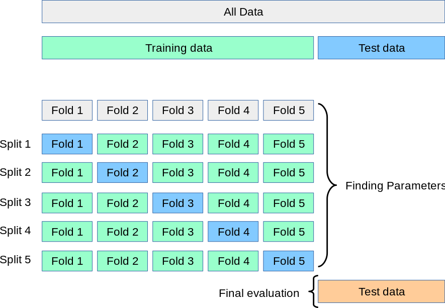
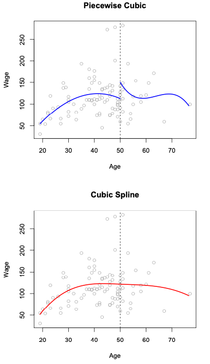
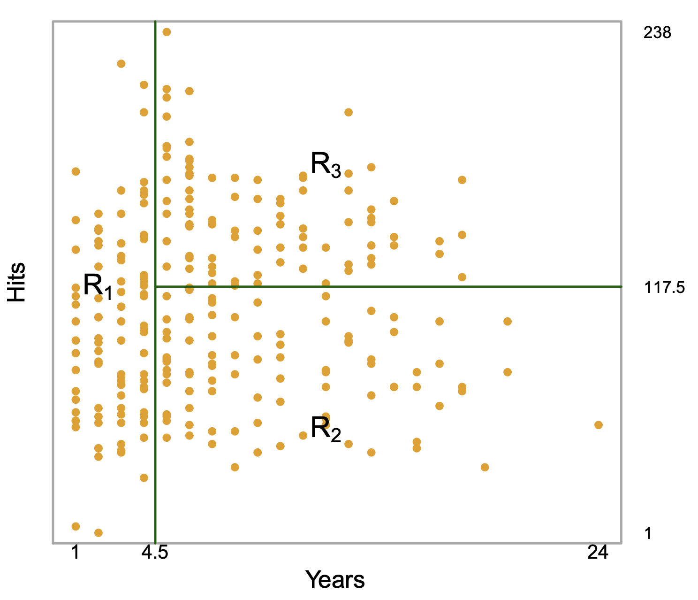
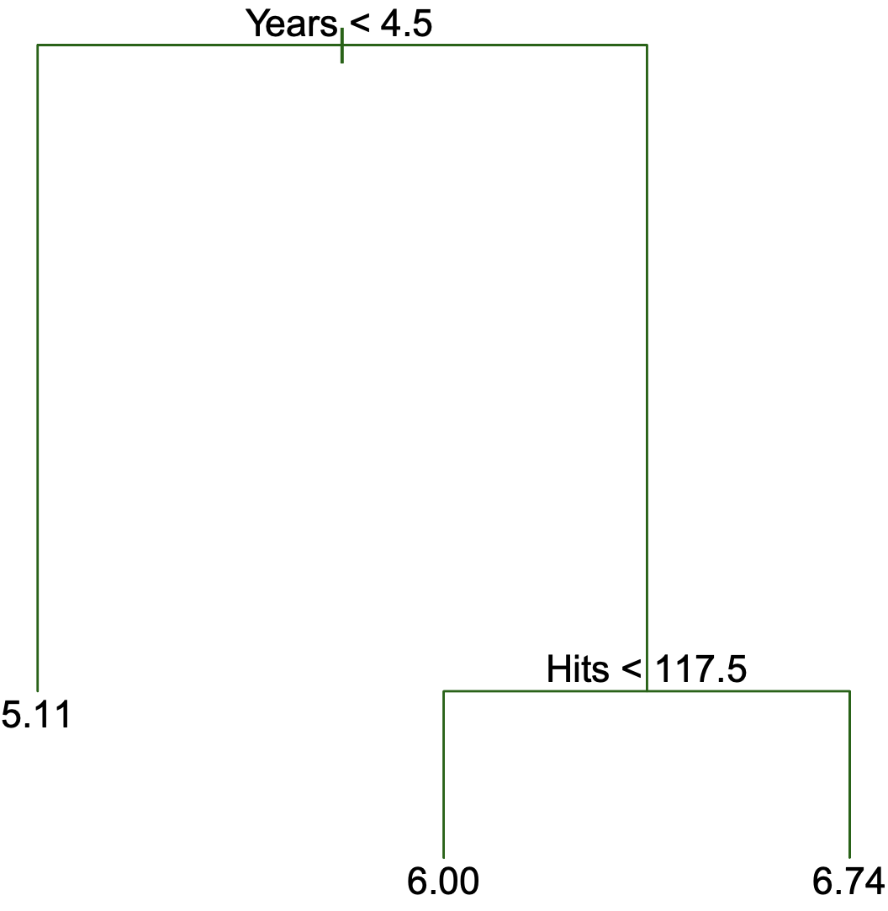

## Insights from Exercise 3?

-   Any questions about the code?

-   How is it exploring categorical predictors?

-   Interpreting residual deviance plot?

    -   Binned data only shows us part of the story between the predictor and log odds of the response

## Overfitting

**Overfitting** is the phenomena when the model learns patterns that are only specific to a dataset that it not generalizable anywhere else.

. . .

We currently safeguard it via fitting the model on the **Training Set**, and evaluate the model on the **Testing Set.**

. . .

We haven't discussed what factors leads to **overfitting**. Namely,

. . .

1.  Over-use of predictors
2.  Overly-fleixble models

## Over-use of predictors

One way to increase the risk of Overfitting is to use a large amount of predictors in the model relative to the number of samples.

. . .

When number of predictors approach the number of samples, the model becomes increasingly flexible: it can perform an almost perfect fit of the training data *regardless whether the predictors are related to the outcome*.

. . .


## Piling on unrelated predictors

In our NHANES dataset, let's see what happens if we just start piling on predictors for our model, without considering whether the predictors are useful or not.

```{python}
#| echo: False
import pandas as pd
import seaborn as sns
import numpy as np
from sklearn.model_selection import train_test_split, cross_val_score, cross_val_predict
from sklearn.metrics import mean_squared_error
import matplotlib.pyplot as plt
from formulaic import model_matrix
from sklearn import linear_model
import statsmodels.api as sm

nhanes = pd.read_csv("../classroom_data/NHANES.csv")
nhanes.drop_duplicates(inplace=True)
nhanes['MeanBloodPressure'] = nhanes['BPDiaAve'] + (nhanes['BPSysAve'] - nhanes['BPDiaAve']) / 3 

#Use a small part of the data to illlustrate overfitting.
nhanes_tiny = nhanes.sample(n=300, random_state=2)

train_err = []

test_err = []
# We pick predictors that don't have too much missing data and just start adding predictors to our model:
nhanes_tiny2 = nhanes.loc[:, ["MeanBloodPressure", "Gender", "Age", "Race1", "Education", "MaritalStatus", "Poverty", "HomeRooms", "HomeOwn", "Work", "BMI", "Pulse", "DirectChol", "TotChol", "UrineVol1", "UrineVol2", "Diabetes", "HealthGen", "SleepHrsNight"]]
y, X = model_matrix("MeanBloodPressure ~ .", nhanes_tiny2)

predictors_to_iterate = list(range(1, X.shape[1]))

for n_predictors in predictors_to_iterate:
  Xtemp = X.iloc[:, :n_predictors]
  X_train, X_test, y_train, y_test = train_test_split(Xtemp, y, test_size=0.5, random_state=42)
  linear_reg = linear_model.LinearRegression().fit(X_train, y_train)
  y_train_predicted = linear_reg.predict(X_train)
  y_test_predicted = linear_reg.predict(X_test)
  train_err.append(mean_squared_error(y_train_predicted, y_train))
  test_err.append(mean_squared_error(y_test_predicted, y_test))
  
plt.clf()
plt.plot(predictors_to_iterate, train_err, color="blue", label="Training Error")
plt.plot(predictors_to_iterate, test_err, color="red", label="Testing Error")
plt.xlabel('Number of Predictors')
plt.ylabel('Error')
plt.legend()
plt.show()  
```

## Overly-flexible models

In the polynomial regression example, the more polynomial degree we grant the model, the more flexible the model is to fit any pattern. Here, we are at risk of the model picking up fine-grain detail in the training set that is not generalizable to the test set.

. . .

Let's look at some synthetic data:

```{python}
#| echo: False

from sklearn.preprocessing import PolynomialFeatures
from sklearn.linear_model import LinearRegression

# Generate synthetic data
np.random.seed(0)
x = np.linspace(0, 10, 100)
y = np.sin(x) + np.random.normal(scale=0.2, size=x.shape)

# Split data into training and testing sets
x_train, x_test, y_train, y_test = train_test_split(x, y, test_size=0.3, random_state=0)

plt.clf()
fig, (ax1, ax2) = plt.subplots(2, layout='constrained')

ax1.scatter(x_train, y_train, color='blue')
ax1.set_title("Training Set")
ax1.set(xlabel='', ylabel='Response')

ax2.scatter(x_test, y_test, color='blue')
ax2.set_title("Testing Set")
ax2.set(xlabel='Predictor', ylabel='Response')

plt.show()
```

## If we increase our model flexibility...

```{python}
#| echo: False

degrees = range(1, 21)
train_errors = []
test_errors = []
for degree in degrees:
    poly_features = PolynomialFeatures(degree=degree)
    x_poly_train = poly_features.fit_transform(x_train[:, np.newaxis])
    x_poly_test = poly_features.transform(x_test[:, np.newaxis])
    
    model = LinearRegression()
    model.fit(x_poly_train, y_train)
    
    train_predictions = model.predict(x_poly_train)
    test_predictions = model.predict(x_poly_test)
    
    train_errors.append(mean_squared_error(y_train, train_predictions))
    test_errors.append(mean_squared_error(y_test, test_predictions))
    
    if degree == 1 or degree == 3 or degree == 6 or degree == 20:
      plt.clf()
      fig, (ax1, ax2) = plt.subplots(2, layout='constrained')
      ax1.scatter(x_train, y_train, color='blue')
      ax1.scatter(x_train, train_predictions, color='red')
      ax1.set_title("Training Set on Degree " + str(degree) + " polynomial")
      ax1.set(xlabel='', ylabel='Response')
      
      ax2.scatter(x_test, y_test, color='blue')
      ax2.scatter(x_test, test_predictions, color='red')
      ax2.set(xlabel='Predictor', ylabel='Response')
      ax2.set_title("Testing Set on Degree " + str(degree) + " polynomial")
      
      plt.show()

```

## ...we start to see overfitting

```{python}
#| echo: False

plt.figure(figsize=(10, 6))
plt.plot(degrees, train_errors, label='Train Error', marker='o')
plt.plot(degrees, test_errors, label='Test Error', marker='o')
plt.title('Learning Curves')
plt.xlabel('Polynomial Degree')
plt.ylabel('Mean Squared Error')
plt.xticks(degrees)
plt.legend()
plt.show()
```

## Bias Variance Trade-off

Suppose that we have a **population** of data that is out in the wild. We collect a **sample** as our training data set to build a model $f_1()$, and suppose that we then sample *several* more *training* *datasets* to build models $f_2(), … f_n()$ with the same model specifications, but each of the models have slightly different learned parameters due to sampling differences.

. . .

-   When we have Underfitting, the equation of the model usually is more simple than the data itself (high bias), but because of its simplicity, the learned models $f_1(), … f_n()$ look fairly similar (low variance).

-   When we have Overfitting, the equation of the model usually is more complex than the data itself (low bias), but because of its complexity, the learned models $f_1(), … f_n()$ look fairly different (high variance)

## The paradox of the Test Set

The more we evaluate new models on the Test Set, our brain starts to know what models perform well on the Test Set, which influences what models are used!

What should we do?

. . .

-   Validation Set

-   K-fold Cross Validation

## K-fold Cross Validation

The Training Set is partitioned into $k$ small sets (called "**K folds**"). As an example, let's suppose $k=5$. Here is what happens next:

{width="500"}

## K-fold Cross Validation steps

-   We decide on a particular model with appropriate predictors and any polynomial expansions.

-   The model is trained on the folds 2-5. Then, evaluate the model on the fold that was not used: the 1st fold.

-   Permute to the next set of 4 folds: The same model specification is trained on folds 1, 3, 4, 5, and is evaluated on the 2nd fold.

-   Permute to the next set of 4 folds: The same model specification is trained on folds 1, 2, 4, 5 and is evaluated on the 3rd fold. And so on.

-   When finished, take the average of the evaluations: this is the average performance for our model.

## Demo code

```{python}
p_degree = 2

y, X = model_matrix("MeanBloodPressure ~ poly(BMI, degree=" + str(p_degree) + ", raw=True)", nhanes_tiny)

X_train, X_test, y_train, y_test = train_test_split(X, y, test_size=0.5, random_state=42)

linear_reg_poly2 = linear_model.LinearRegression()
scores = cross_val_score(linear_reg_poly2, X_train, y_train, cv=5, scoring="neg_mean_absolute_error")

-np.mean(scores)
```

## Cubic Splines

Sometimes, polynomials are not sufficient to capture the non-linearity of the data.

. . .

Instead of a degree 3 (Cubic) polynomial:

$$
Y = \beta_0 + \beta_1 \cdot X + \beta_2 \cdot X^2 + \beta_3 \cdot X^3
$$

We split it into two sections at a breakpoint $c$:

$$
 Y = \begin{cases}
      \beta_{01} + \beta_{11} \cdot X + \beta_{21} \cdot X^2 + \beta_{31} \cdot X^3 & \text{if $X < c$}\\
      \beta_{02}+ \beta_{12} \cdot X + \beta_{22} \cdot X^2 + \beta_{32} \cdot X^3 & \text{if $X \ge c$}\\
    \end{cases} 
$$

. . .

This is a **Piecewise Cubic Regression**, an example can be seen in the top panel of this figure:



. . .

To make the breakpoints connected and smooth, we use a **Cubic Spline**.

This cubic spline model uses $K + 4$ predictors, where $K$ is the number of cutoff points used.

. . .

Can you think how Cross Validation can be useful here?

## Decision Trees

These models involve *segmenting* our predictor space into a number of regions, and then take the mean response value as our predicted value.

{width="450"}

. . .

{width="300"}

. . .

1.  Divide the predictor space for $X_1$, $X_2$, ... $X_p$ into $J$ distinct and non-overlapping regions, $R_1$, $R_2$, ..., $R_J$.
2.  For every observation that falls into region $R_j$, make the same prediction, which is the mean of the response values for the training observations in $R_j$.

## How to divide the predictor space? 

"Recursive binary splitting" for two predictors $X_1$ and $X_2$:

-   Find the optimal way to split this space into two regions, $R_1$, $R_2$: Consider a range of cutpoints across $X_1$ and $X_2$.

    -   For each considered region pair, calculate the mean of the response values for the training observations in each region.

    -   Calculate the average error between the mean response value and the responses in each region.

    -   The candidate region that has the lowest average error is kept.

Repeat this process on $R_1$ and $R_2$ until we have the desired tree depth. A nice animation of this is [shown here](https://mlu-explain.github.io/decision-tree/).

```{python}
from sklearn.tree import export_text
from sklearn.tree import DecisionTreeRegressor

y, X = model_matrix("MeanBloodPressure ~ BMI + Age", nhanes_tiny)
X_train, X_test, y_train, y_test = train_test_split(X, y, test_size=0.5, random_state=42)

decision_tree = DecisionTreeRegressor(max_depth=3).fit(X_train, y_train)
print(export_text(decision_tree, feature_names=X_train.columns))

```

## Appendix: Small datasets

Scenario: The dataset is small enough that we need to maximize the number of samples for model fitting, as the model parameters require a sample size large enough to have statistical certainty.

. . .

Problem: we only have one dataset to work with. Our standard metric of Mean Squared Error or Mean Absolute Error is likely an underestimate of the real world Mean Squared Error or Mean Absolute Error.

. . .

Metrics that will "adjust" the error to consider the possible amount of overfitting at risk:

-   The **Akaike Information Criterion (AIC)** takes the Mean Squared Error and add a penalty for the number of predictors added. This metric is optimized for prediction and classification uses.

-   The B**ayesican Information Criterion (BIC)** has a similar form as the AIC, but this metric is optimized for inference uses.

. . .

Pick the model with the lowest AIC or BIC.

. . .

These metrics are automatically calculated in the model fits of the `statsmodels` package.
