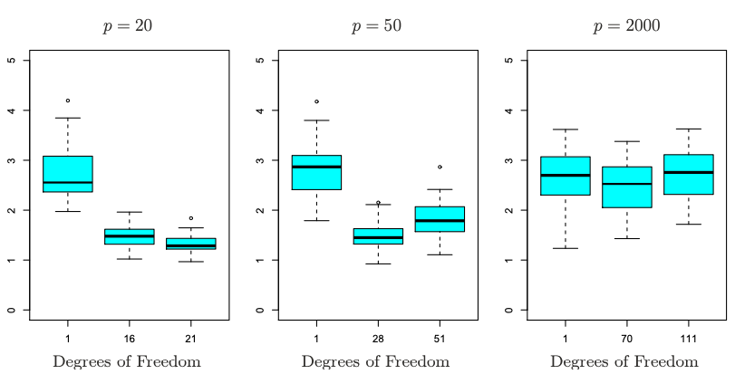
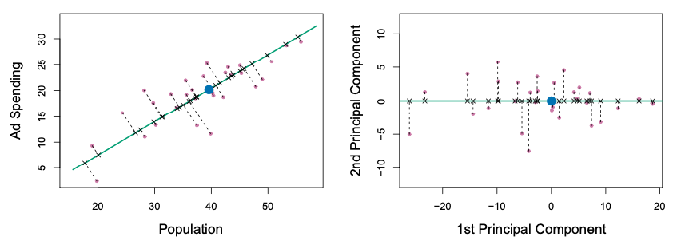
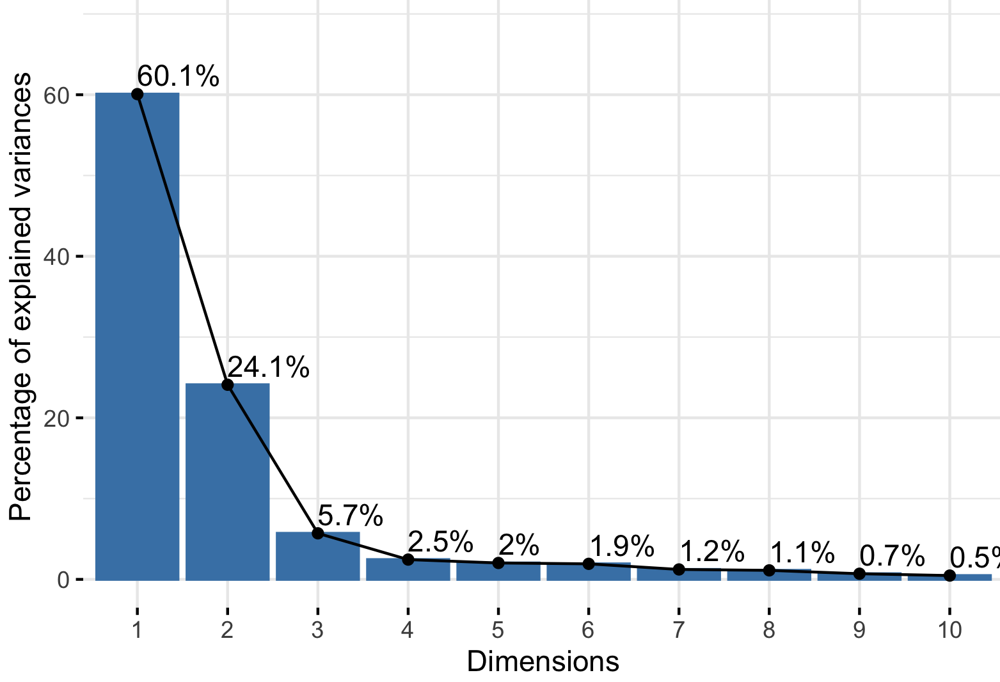

## Insights from Exercise 4?

-   Any questions about the code?
-   Last of class RSVP: <https://forms.gle/MtRJnFeUELSdU8Ny7>

## High Dimensional Problems

...When the number of predictors is *greater* than the number of samples analyzed.

. . .

-   In molecular biology, high-throughput sequencing technologies generate thousands of predictors across a human genome at once.

. . .

-   In computer vision, one can imagine gathering thousands of predictors from a image.

. . .

-   In Natural Language Processing (NLP), one can derive predictors from single words, or a collection of words, such as themes or writing style.

## Challenges of high dimension regression

When the number of predictors is near the the number of samples or have exceeded it:

. . .

-   Training error approaches 0.

. . .

-   Most predictors in the model can be written as a combination of other predictors, so the problem of predictors correlated to each other is present everywhere.

. . .

-   Therefore, we can never identify the best predictors of the outcome, only one of of many possible combinations fo predictors to consider.

. . .

-   Predictor-response plots will not tell the whole story, due to projecting down too many dimensions.

. . .

-   Most statistics of fit that are used in low-dimensional regression, such as p-values, $R^2$, AIC, BIC on the training dataset does not work at the high dimensional setting.

. . .

Solutions: **Dimension reduction** techniques, such as **regularization methods** and **Principal Components Analysis (PCA)**.

## **Regularization** methods

**Regularization Methods** will naturally encourage some of the parameter estimates to be zero.

. . .

Recall that in linear regression, we fit a line where the Mean Squared Error (MSE) is minimized. In regularization methods, the quantity we try to minimize for the model includes additional terms:

$$
minimize(MSE + \lambda \cdot Parameters)
$$

. . .

-   When $\lambda=0$, we just have to minimize the $MSE$, ie. linear regression.

. . .

-   When $\lambda$ is large, then we start to minimize $Parameters$ more and encourages some of the parameter estimates to be zero.

. . .

-   We select $\lambda$ via Cross-Validation.

. . .

```{python}
#| echo: False
import pandas as pd
import seaborn as sns
import numpy as np
import matplotlib.pyplot as plt
from sklearn.datasets import load_diabetes
from sklearn.linear_model import LassoCV, lasso_path

X, y = load_diabetes(return_X_y=True)
X = X[:, :5]
X /= X.std(axis=0)

alphas_lasso, coefs_lasso, _ = lasso_path(X, y, n_alphas=10, eps=5e-3)

plt.clf()

for i, coef_lasso in enumerate(coefs_lasso):
    plt.semilogx(alphas_lasso, coef_lasso, label='beta'+str(i+1))

plt.xlabel("lambda")
plt.ylabel("coefficients")
plt.title("Effect of lambda on regression coefficients")
plt.axis("tight")
plt.legend()

plt.show()
```

## Example Dataset

*Can we use RNA gene expression predict response to a cancer treatment?* We use data from the [Dependency Map Project](https://depmap.org/portal/), which has RNA gene expression profiles and cancer treatment responses on the largest collection of cancer cell line models.

. . .

Let's start looking at the cancer drug "Gefitinib", which is a targeted therapy for non-small cell lung cancer with EGFR mutation and high levels of EGFR expression.

. . .

```{python}
#| echo: False

from sklearn.model_selection import train_test_split
from formulaic import model_matrix
from sklearn.linear_model import LogisticRegression
from sklearn.preprocessing import StandardScaler
from sklearn.metrics import mean_squared_error, mean_absolute_error, log_loss, accuracy_score, confusion_matrix, ConfusionMatrixDisplay
import pickle

with open('../classroom_data/GEFITINIB_Expression.pickle', 'rb') as handle:
    gefitinib_expression = pickle.load(handle)
    
plt.clf()
g = sns.displot(x="GEFITINIB", data=gefitinib_expression)
plt.show()
```

. . .

The drug response is measured in terms of [Area Under the Curve](https://en.wikipedia.org/wiki/Area_under_the_curve_(pharmacokinetics)) (unrelated to the appendix of the ROC curve in the 3rd week), and a lower value indicates that the drug is more effective against the cancer.

## Data Preparation

Then, let's look at the dimensions of this Dataframe:

```{python}
#| echo: False

gefitinib_expression.shape
```

. . .

We split into training and when create our `y_train` and `X_train` variables, we need to use all predictors, and that is indicated via the `.` symbol.

```{python}
#| echo: False

gefitinib_expression_train, gefitinib_expression_test = train_test_split(gefitinib_expression, test_size=0.2, random_state=42)
```

```{python}
y_train, X_train = model_matrix("GEFITINIB ~ .", gefitinib_expression_train)
y_test, X_test = model_matrix("GEFITINIB ~ .", gefitinib_expression_test)
```

## Data standardization

In linear and logistic regression, all the parameter estimates for the models are **scale equivariant**: a predictor multiplied by $c$ will have a parameter estimate multiplied by $\frac{1}{c}$ .

. . .

However, in regularization methods, because we are minimizing the Mean Squared Error and the magnitude of the parameters, this does not hold.

. . .

We first **standardize the predictors** before using regularization methods. We use the following code to ensure that each predictor has a mean of 0 and variance of 1:

```{python}
X_train_scaled = StandardScaler().fit_transform(X_train, y_train)
X_test_scaled = StandardScaler().fit_transform(X_test, y_test)
```

## Lasso regression

```{python}
reg = LassoCV(cv=2, random_state=42).fit(X_train_scaled, np.ravel(y_train))
```

. . .

What is the $\lambda$ learned in the cross validation?

```{python}
print(reg.alpha_) #lambda is referred as alpha in scikit-learn, unfortunately.
```

. . .

What are the genes that have non-zero coefficients?

```{python}
#| echo: False
X_train.columns[np.nonzero(reg.coef_)]
```

. . .

\
Evaluate on the Test Set:

```{python}
#| echo: False
y_test_predicted = reg.predict(X_test_scaled)
test_err = mean_absolute_error(y_test_predicted, y_test)
test_err
```

. . .

```{python}
#| echo: False

plt.clf()
plt.scatter(y_test_predicted, y_test, alpha=.5)
plt.axline((.95, .95), slope=1, color='r', linestyle='--')
plt.xlim(.8, 1)
plt.ylim(.8, 1)
plt.xlabel('Predicted AUC')
plt.ylabel('True AUC')
plt.title('Mean Absolute Error: ' + str(round(test_err, 2)))
plt.show()
```

## Benchmarking the Lasso

To understand the performance of a model, often people run **simulations** to see how it perform using a generated ground truth.

. . .

In this simulation, 100 samples were generated with $p=20$, $p=50$, or $p=2000$ features, of which 20 are truly associated with the outcome.

{width="600"}

## Principal Components Analysis (PCA)

Suppose that you have 100 predictors, and you look at the total variance of the predictors.

. . .

When one performs PCA, the process will take a linear combination of the 100 original predictors to yield a new predictor (the first principal component) that captures the most variability of the total variance: $Z_1 = \sum^{100}_{i=1}\phi_{1i}X_i$

. . .

Then, the second principal component is another combination of the 100 original predictors that captures the most of the *remaining* variability, and is perpendicular with the first principal component: $Z_2 = \sum^{100}_{i=1}\phi_{2i}X_i$.

. . .

We can visualize this in the case of two predictors:



. . .

Perhaps it is possible to use $Z_1$, ..., $Z_5$ as our new predictors that capture most of the variability for $X_1$, ..., $X_{100}$.

. . .

This is done with the assumption that the variability of the predictors is related with the variance of the response.

## Choice on the number of Principal Components

-   Cross Validation

. . .

-   Scree Plot

. . .

{width="400"}
