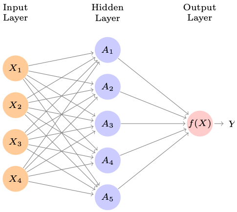

## Single Layer Neural Networks

A neural network takes in predictors $X_1$, $X_2$, ..., $X_p$ and builds a *nonlinear* function $f(X)$ to predict a response $Y$.

. . .



. . .

The following equations are implied:

-   $A_1 = \beta_{1,0} + \beta_{1, 1} \cdot X_1 + \beta_{1, 2} \cdot X_2 + \beta_{1, 3} \cdot X_3 + \beta_{1, 4} \cdot X_4$

. . .

-   $A_2 = \beta_{2,0} + \beta_{2, 1} \cdot X_1 + \beta_{2, 2} \cdot X_2 + \beta_{2, 3} \cdot X_3 + \beta_{2, 4} \cdot X_4$

. . .

-   . . .

-   $A_5 = \beta_{5,0} + \beta_{5, 1} \cdot X_1 + \beta_{5, 2} \cdot X_2 + \beta_{5, 3} \cdot X_3 + \beta_{5, 4} \cdot X_4$

. . .

-   $Y = f(X) = \beta_{6,0} + \beta_{6, 1} \cdot A_1 + \beta_{6, 2} \cdot A_2 + \beta_{6, 3} \cdot A_3 + \beta_{6, 4} \cdot A_4 + \beta_{6, 5} \cdot A_5$

## The non-linear part of this

To incorproate the non-linear transformations, a transformation $g()$ for each of the equations:

-   $A_1 = g(\beta_{1,0} + \beta_{1, 1} \cdot X_1 + \beta_{1, 2} \cdot X_2 + \beta_{1, 3} \cdot X_3 + \beta_{1, 4} \cdot X_4)$

-   $A_2 = g(\beta_{2,0} + \beta_{2, 1} \cdot X_1 + \beta_{2, 2} \cdot X_2 + \beta_{2, 3} \cdot X_3 + \beta_{2, 4} \cdot X_4)$

-   . . .

-   $A_5 = g(\beta_{5,0} + \beta_{5, 1} \cdot X_1 + \beta_{5, 2} \cdot X_2 + \beta_{5, 3} \cdot X_3 + \beta_{5, 4} \cdot X_4)$

-   $Y = f(X) = g(\beta_{6,0} + \beta_{6, 1} \cdot A_1 + \beta_{6, 2} \cdot A_2 + \beta_{6, 3} \cdot A_3 + \beta_{6, 4} \cdot A_4 + \beta_{6, 5} \cdot A_5)$

. . .

{width="400"}

## A modern example

The figure below shows examples of handwritten digits from the "MNIST" dataset. Each grayscale image has 28x28 pixels, each with a 0-255 number showing how dark the pixel is.


. . .

The following neural network was built:


. . .

-   The input layer has 784 predictors (one for each pixel of an image),

-   Two hidden layers with 256 and 128 predictors.

-   235,146 parameters to be learned!

-   60,000 training images, 10,000 test images.

## Doing it in Python

-   ScikitLearn has some simple implementations you can try:

```         
from sklearn.neural_network import MLPRegressor

nn = MLPRegressor(hidden_layer_sizes=(200,1), random_state=1, max_iter=5000)
nn_model = nn.fit(X_train_scaled, np.ravel(y_train))
```

. . .

-   [Pytorch](https://pytorch.org/)

-   [Keras](https://keras.io/) / [Tensorflow](https://www.tensorflow.org/)

    -   Often need GPUs, high performance computing, cloud computing

## What model should you use?


## Additional topics

-   Supervised vs Unsupervised Learning

-   Statistical Inference

-   Feature Engineering

-   Model Deployment

## Reference texts

-   [An Introduction to Statistical Learning](https://www.statlearning.com/), by Daniela Witten

-   [Applied Predictive Modeling](http://appliedpredictivemodeling.com/), by Max Kuhn

## Consulting Resources

-   [Data House Calls](https://ocdo.fredhutch.org/programs/dhc.html)

-   [Biostatistics Consulting](https://research.fredhutch.org/biostatistics-consulting-collaboration-center/en.html)

## Certification

You need to complete 4 out of 5 exercises - I'll been keeping track and let you know soon.

## Please fill out survey!

Our [class survey](https://forms.gle/9jmeMYJPKsFyAPMt6) makes a huge difference for us.

## 
